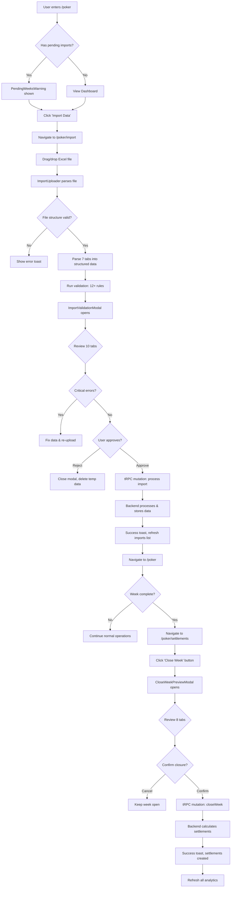

# Frontend UX Flow Map - Poker Module

**Generated:** 2026-01-21
**Scope:** Complete frontend mapping from club entry → spreadsheet import → validation → approval → weekly settlement

---

## Table of Contents

1. [Technology Stack](#technology-stack)
2. [Route Architecture](#route-architecture)
3. [Component Hierarchy](#component-hierarchy)
4. [User Journey Flow](#user-journey-flow)
5. [State Management](#state-management)
6. [Data Flow (tRPC Integration)](#data-flow-trpc-integration)
7. [Custom Hooks](#custom-hooks)
8. [Critical Components Deep Dive](#critical-components-deep-dive)
9. [Points of Concern](#points-of-concern)

---

## Technology Stack

### Core Framework
- **Next.js 16** with App Router (App Directory structure)
- **React 19** with Server Components and Client Components
- **TypeScript** for type safety across the stack

### State Management
- **React Query (via tRPC)** - Server state management
- **Zustand** - Client-side global state (minimal usage in poker module)
- **nuqs** - URL state management for filters and pagination

### API Communication
- **tRPC v11** - Type-safe API calls to Hono backend
- **SuperJSON** - Serialization for complex types (Date, BigInt, etc.)
- **React Query** - Caching, refetching, optimistic updates

### UI Libraries
- **Tailwind CSS** - Styling
- **shadcn/ui** - Component primitives (Dialog, Table, Button, etc.)
- **react-dropzone** - File upload
- **xlsx + papaparse** - Spreadsheet parsing

---

## Route Architecture

### Route Hierarchy (Next.js App Router)

```
apps/dashboard/src/app/[locale]/(app)/(sidebar)/
└── poker/
    ├── page.tsx                    # Dashboard (entry point)
    ├── import/
    │   └── page.tsx                # Import spreadsheet page
    ├── players/
    │   └── page.tsx                # Players list
    ├── agents/
    │   └── page.tsx                # Agents list
    ├── sessions/
    │   └── page.tsx                # Game sessions list
    ├── transactions/
    │   └── page.tsx                # Transactions list
    ├── settlements/
    │   └── page.tsx                # Weekly settlements list
    └── leagues/
        ├── page.tsx                # Leagues overview
        └── import/
            └── page.tsx            # League import (SuperUnion)
```

### Route Groups

**Layout Wrapper:** `(sidebar)` route group applies shared sidebar layout
**Authentication:** All poker routes require authentication (enforced by parent layout)
**Locale:** `[locale]` dynamic segment for i18n (pt-BR, en-US)

### Dynamic Segments

No dynamic segments in poker routes currently. All state is managed via URL search params (nuqs).

---

## Component Hierarchy

### Top-Level Pages (62 total poker components)

#### 1. Dashboard Page (`/poker`)
```tsx
poker/page.tsx
├── PokerDashboardHeader
├── PokerWidgetProvider (context)
└── PokerWidgetsGrid
    ├── PokerStatCard (8x widgets)
    └── Various analytics widgets
```

**Purpose:** Landing page showing key metrics (total sessions, players, rake, bank result)
**Server Components:** Page shell, data prefetching
**Client Components:** Interactive widgets, filters

#### 2. Import Page (`/poker/import`)
```tsx
poker/import/page.tsx
├── PokerImportHeader
├── ImportUploader (main upload component)
│   ├── react-dropzone integration
│   ├── XLSX/CSV parsing
│   ├── ImportValidationModal
│   │   ├── Tabs (10 validation tabs)
│   │   ├── ValidationTab (12+ rule checks)
│   │   ├── GeneralTab, DetailedTab, SessionsTab, etc.
│   │   └── Approve/Reject actions
│   └── File processing state
└── ImportsList (history of imports)
    └── Infinite scroll list
```

**Purpose:** Upload and validate Excel spreadsheets from PPPoker
**Critical Path:** File upload → Parse → Validate (12+ rules) → Approve → Process

#### 3. Settlements Page (`/poker/settlements`)
```tsx
poker/settlements/page.tsx
├── PokerSettlementsHeader
│   ├── CloseWeekButton (triggers weekly settlement)
│   ├── WeekPeriodIndicator
│   └── Filters
└── SettlementsDataTable
    ├── DataTable (tanstack/react-table)
    ├── Pagination
    └── Row actions
```

**Purpose:** View and close weekly settlements
**Critical Action:** CloseWeekButton triggers settlement calculation

#### 4. Players Page (`/poker/players`)
```tsx
poker/players/page.tsx
├── PokerPlayersHeader
│   ├── PokerPlayerFilters
│   │   ├── Search input
│   │   ├── Type filter (player/agent)
│   │   ├── Status filter
│   │   └── Agent hierarchy filters
│   └── Actions (Create player, Export)
├── PokerPlayersStats (summary cards)
└── PlayersDataTable
    ├── OpenPlayerSheet (detail view)
    └── Row actions
```

**Purpose:** Manage players and agents with hierarchy
**Filters:** 12+ filter options (search, type, status, agent, balance flags)

#### 5. Sessions, Transactions, Agents Pages
Similar structure: Header → Filters → Stats → DataTable

### Validation Tabs (10 tabs in ImportValidationModal)

Located in `/components/poker/validation-tabs/`:

1. **ResumoTab** - Summary of validation results
2. **GeneralTab** - Geral sheet data (48 columns)
3. **DetailedTab** - Detalhado sheet data (137 columns)
4. **SessionsTab** - Partidas sheet data (12 columns)
5. **TransactionsTab** - Transações sheet data (21 columns)
6. **DemonstrativoTab** - Demonstrativo sheet data (8 columns)
7. **UserDetailsTab** - Detalhes do usuário (12 columns)
8. **RakebackTab** - Retorno de taxa (7 columns)
9. **CadastroTab** - Cadastro/registration data
10. **ValidationTab** - Validation rules and status

**League Import Tabs** (8 tabs for SuperUnion multi-club imports):
- Located in `/components/poker/league-validation-tabs/`
- Similar structure but for league-wide data

### Close Week Tabs (8 tabs in CloseWeekPreviewModal)

Located in `/components/poker/close-week-tabs/`:

1. **ResumoTab** - Summary of week closure
2. **GeralTab** - General overview
3. **SessionsTab** - Sessions to be closed
4. **RakebackTab** - Rakeback calculations
5. **SettlementsTab** - Individual settlements
6. **LigaTab** - League-related settlements
7. **DespesasTab** - Expenses/costs
8. **RakebackEditDialog** - Edit rakeback percentages

---

## User Journey Flow

### Primary Flow: Import → Validate → Approve → Close Week



### Navigation Paths

**Entry Points:**
1. `/poker` - Dashboard (most common)
2. `/poker/import` - Direct to import (from notification/link)
3. `/poker/settlements` - Review settlements

**Critical Decision Points:**
- **Import Validation:** User must approve or reject after reviewing 10 tabs
- **Week Closure:** User confirms after reviewing 8 preview tabs
- **Error Handling:** Critical errors block approval, warnings allow override

---

## State Management

### URL State (nuqs)

Each page manages filters via URL search params:

**Players Page:**
```typescript
// apps/dashboard/src/hooks/use-poker-player-params.ts
{
  playerId: string | null,
  q: string | null,              // Search query
  type: "player" | "agent" | null,
  status: "active" | "inactive" | "suspended" | "blacklisted" | null,
  agentId: string | null,
  superAgentId: string | null,
  dateFrom: string | null,
  dateTo: string | null,
  hasCreditLimit: boolean,
  hasRake: boolean,
  hasBalance: boolean,
  hasAgent: boolean
}
```

**Settlements Page:**
```typescript
// apps/dashboard/src/hooks/use-poker-settlement-params.ts
{
  settlementId: string | null,
  status: "pending" | "approved" | "rejected" | null,
  playerId: string | null,
  weekStart: string | null,
  weekEnd: string | null
}
```

**Sessions, Transactions, Agents:** Similar param schemas

### Server State (React Query via tRPC)

All poker data is fetched via tRPC endpoints:

```typescript
// Example usage in components
const { data, isLoading } = useTRPC().poker.players.get.useInfiniteQuery({
  q: params.q,
  type: params.type,
  status: params.status,
  // ... other filters
});
```

**Infinite Queries:**
- Players list
- Sessions list
- Transactions list
- Settlements list
- Imports history

**Single Queries:**
- Dashboard analytics (overview, rake breakdown, top players)
- Player details
- Settlement details

### Local Component State

**Import Flow:**
```typescript
// ImportUploader.tsx
const [selectedFile, setSelectedFile] = useState<File | null>(null);
const [parsedData, setParsedData] = useState<ParsedImportData | null>(null);
const [validationResult, setValidationResult] = useState<ValidationResult | null>(null);
const [showValidationModal, setShowValidationModal] = useState(false);
const [isProcessing, setIsProcessing] = useState(false);
```

**Validation Modal:**
```typescript
// ImportValidationModal.tsx
const [activeTab, setActiveTab] = useState("resumo");
```

### Zustand Stores (Minimal Usage)

Poker module does NOT have dedicated Zustand stores. All state is:
1. URL params (filters, pagination)
2. React Query cache (server data)
3. Local component state (UI interactions)

**Note:** Other modules (invoices, vault, transactions) use Zustand for complex UI state, but poker keeps it simple.

---

## Data Flow (tRPC Integration)

### Request Flow: Client → API

```
User Action (e.g., filter players)
  ↓
URL params updated (nuqs)
  ↓
usePokerPlayerParams() hook reads params
  ↓
useTRPC().poker.players.get.useInfiniteQuery(params)
  ↓
tRPC client sends HTTP POST to /trpc
  ↓
Authorization: Bearer [Supabase JWT]
  ↓
API middleware chain:
  - Rate limiting (1000 req/10min)
  - Team permission check
  - Primary read-after-write consistency
  ↓
Router procedure executes
  ↓
packages/db queries run (Drizzle ORM)
  ↓
Response serialized (SuperJSON)
  ↓
React Query cache updated
  ↓
Component re-renders with new data
```

### Key tRPC Endpoints Used

**Poker Router Namespace:** `trpc.poker.*`

```typescript
// Imports
trpc.poker.imports.get.useInfiniteQuery()
trpc.poker.imports.process.useMutation()
trpc.poker.imports.delete.useMutation()

// Players
trpc.poker.players.get.useInfiniteQuery()
trpc.poker.players.create.useMutation()
trpc.poker.players.update.useMutation()
trpc.poker.players.delete.useMutation()

// Settlements
trpc.poker.settlements.get.useInfiniteQuery()
trpc.poker.settlements.closeWeek.useMutation()  // Critical!
trpc.poker.settlements.approve.useMutation()
trpc.poker.settlements.reject.useMutation()

// Analytics (dashboard)
trpc.poker.analytics.getOverview.useQuery()
trpc.poker.analytics.getGrossRake.useQuery()
trpc.poker.analytics.getBankResult.useQuery()
trpc.poker.analytics.getTopPlayers.useQuery()
trpc.poker.analytics.getDebtors.useQuery()

// Sessions
trpc.poker.sessions.get.useInfiniteQuery()

// Transactions
trpc.poker.transactions.get.useInfiniteQuery()

// Agents
trpc.poker.agents.get.useInfiniteQuery()
```

### Mutation Flow: Import Processing

```
User approves import in modal
  ↓
onClick={() => processMutation.mutate({ importId, parsedData })}
  ↓
tRPC mutation: poker.imports.process
  ↓
Backend validates data again (never trust client)
  ↓
Start transaction:
  1. Create poker_imports record
  2. Upsert players (poker_players)
  3. Insert sessions (poker_sessions)
  4. Insert session_players (poker_session_players)
  5. Insert transactions (poker_chip_transactions)
  6. Calculate balances
  7. Commit transaction
  ↓
Return success + importId
  ↓
onSuccess callback:
  - Show success toast
  - queryClient.invalidateQueries() for relevant data
  - Close validation modal
  - Refresh imports list
```

### Cache Invalidation Strategy

After mutations, specific queries are invalidated:

```typescript
// Example: After closing week
onSuccess: () => {
  queryClient.invalidateQueries({
    queryKey: trpc.poker.analytics.getOverview.queryKey(),
  });
  queryClient.invalidateQueries({
    queryKey: trpc.poker.settlements.get.queryKey(),
  });
  // ... 5 more invalidations
}
```

**Pattern:** Granular invalidation (not `invalidateAll()`) to minimize refetches.

---

## Custom Hooks

### URL Param Hooks (nuqs-based)

Located in `/apps/dashboard/src/hooks/`:

1. **use-poker-player-params.ts**
   - Manages: player filters (12 params)
   - Returns: `{ ...params, setParams(), hasFilters, hasDateFilter }`
   - Server loader: `loadPokerPlayerFilterParams(searchParams)`

2. **use-poker-settlement-params.ts**
   - Manages: settlement filters (6 params)
   - Returns: Similar structure

3. **use-poker-session-params.ts**
   - Manages: session filters (8 params)

4. **use-poker-transaction-params.ts**
   - Manages: transaction filters (10 params)

5. **use-poker-dashboard-params.ts**
   - Manages: dashboard date range, period selection

### Pattern: Client + Server Sync

```typescript
// Client usage
const { q, type, setParams } = usePokerPlayerParams();

// Server-side (in page.tsx)
const filter = loadPokerPlayerFilterParams(searchParams);
await queryClient.fetchInfiniteQuery(
  trpc.poker.players.get.infiniteQueryOptions(filter)
);
```

**Why:** Enables SSR prefetching while maintaining client-side reactivity.

### Sorting Hook (Shared)

```typescript
// apps/dashboard/src/hooks/use-sort-params.ts
const { sort } = loadSortParams(searchParams);
// Returns: { sort: [column, direction] | null }
```

Used across all poker list pages for column sorting.

---

## Critical Components Deep Dive

### ImportUploader.tsx (1,000+ lines)

**Location:** `/apps/dashboard/src/components/poker/import-uploader.tsx`

**Responsibilities:**
1. File drop zone (react-dropzone)
2. Excel/CSV parsing (xlsx + papaparse)
3. 7-tab spreadsheet structure detection
4. Data transformation (PPPoker format → internal schema)
5. Client-side validation (12+ rules via `validateImportData()`)
6. Validation modal orchestration
7. Mutation trigger (process import)

**Key Functions:**

```typescript
// Parse PPPoker spreadsheet into structured data
parseClubMemberSheet(data: any[]): Player[]
parseTransactionSheet(data: any[]): Transaction[]
parseSessionSheet(data: any[]): Session[]
parseGeneralSheet(data: any[]): GeneralData[]
parseDetailedSheet(data: any[]): DetailedData[]
parseDemonstrativoSheet(data: any[]): DemonstrativoData[]
parseUserDetailsSheet(data: any[]): UserDetails[]

// Main parsing orchestrator
onDrop(files: File[]) {
  const file = files[0];
  const workbook = XLSX.read(await file.arrayBuffer());

  // Detect spreadsheet type (club vs league)
  const type = detectSpreadsheetType(workbook.SheetNames);

  // Parse each sheet
  const parsedData = {
    clubMembers: parseClubMemberSheet(sheet1),
    transactions: parseTransactionSheet(sheet2),
    sessions: parseSessionSheet(sheet3),
    // ... 4 more sheets
  };

  // Validate
  const validationResult = validateImportData(parsedData);

  // Open modal
  setShowValidationModal(true);
}
```

**State Machine:**
```
Idle → File Selected → Parsing → Validation → Modal Open → Processing → Success/Error → Idle
```

### ImportValidationModal.tsx (900+ lines)

**Location:** `/apps/dashboard/src/components/poker/import-validation-modal.tsx`

**Responsibilities:**
1. Display 10 tabs with parsed data
2. Show validation results (12+ checks)
3. Quality score calculation (0-100)
4. Week number detection and current week comparison
5. Approve/Reject actions

**Tab Structure:**

```typescript
const TABS = [
  { id: "resumo", name: "Resumo", component: ResumoTab },
  { id: "general", name: "Geral", cols: 48, component: GeneralTab },
  { id: "detailed", name: "Detalhado", cols: 137, component: DetailedTab },
  { id: "sessions", name: "Partidas", cols: 12, component: SessionsTab },
  { id: "transactions", name: "Transações", cols: 21, component: TransactionsTab },
  { id: "demonstrativo", name: "Demonstrativo", cols: 8, component: DemonstrativoTab },
  { id: "user-details", name: "Detalhes do usuário", cols: 12, component: UserDetailsTab },
  { id: "rakeback", name: "Retorno de taxa", cols: 7, component: RakebackTab },
  { id: "cadastro", name: "Cadastro", cols: 0, component: CadastroTab },
  { id: "validation", name: "Validação", cols: 0, component: ValidationTab },
];
```

**Validation Checks (12+ rules):**

```typescript
// From validation.ts
checks: [
  { id: "structure", name: "Estrutura de abas", severity: "critical" },
  { id: "columns", name: "Contagem de colunas", severity: "critical" },
  { id: "player_ids", name: "IDs de jogadores válidos", severity: "critical" },
  { id: "transaction_balance", name: "Balanço de transações", severity: "critical" },
  { id: "session_totals", name: "Totais de sessões", severity: "critical" },
  { id: "rake_match", name: "Rake em sessões vs transações", severity: "high" },
  { id: "duplicates", name: "Jogadores duplicados", severity: "medium" },
  { id: "date_format", name: "Formato de datas", severity: "high" },
  { id: "negative_balances", name: "Saldos negativos", severity: "medium" },
  { id: "orphan_transactions", name: "Transações órfãs", severity: "low" },
  { id: "agent_hierarchy", name: "Hierarquia de agentes", severity: "medium" },
  { id: "credit_limits", name: "Limites de crédito", severity: "low" },
]
```

**Approval Logic:**

```typescript
const canApprove =
  validationResult.hasBlockingErrors === false &&
  parsedData !== null &&
  !isProcessing;

// User clicks "Aprovar"
onApprove={() => {
  processMutation.mutate({
    importId: generateId(),
    parsedData: parsedData,
    validationResult: validationResult,
  });
}}
```

### CloseWeekButton.tsx (104 lines)

**Location:** `/apps/dashboard/src/components/poker/close-week-button.tsx`

**Critical Action:** Triggers weekly settlement calculation

**Flow:**
```typescript
1. User clicks "Fechar Semana"
2. AlertDialog opens with confirmation
3. User confirms
4. Mutation: trpc.poker.settlements.closeWeek.mutate({})
5. Backend:
   - Finds all unsettled transactions for current week
   - Groups by player
   - Calculates net position (rake, rakeback, chips sent/received)
   - Creates poker_settlements records
   - Marks transactions as settled
   - Returns settlement count
6. Success toast: "X settlements created"
7. Invalidate 7 query keys (analytics, settlements)
8. UI refreshes with new settlements
```

**Why Critical:** This is the core business operation. Week closure must be mathematically correct and atomic (transaction-wrapped).

### validation.ts (1,200+ lines)

**Location:** `/apps/dashboard/src/lib/poker/validation.ts`

**Purpose:** Client-side validation before sending to backend

**Why Client-Side?**
- Immediate feedback (no network round-trip)
- Reduce backend load
- UX: Show errors before upload completes

**But:** Backend MUST re-validate (never trust client).

**Rule Examples:**

```typescript
// Check 1: Structure
if (!parsedData.transactions || parsedData.transactions.length === 0) {
  checks.push({
    id: "structure",
    status: "failed",
    severity: "critical",
    message: "Aba 'Transações' está vazia ou ausente"
  });
}

// Check 2: Player IDs
const invalidIds = parsedData.clubMembers.filter(p =>
  !p.ppPokerId || !/^\d+$/.test(p.ppPokerId)
);
if (invalidIds.length > 0) {
  checks.push({
    id: "player_ids",
    status: "failed",
    severity: "critical",
    message: `${invalidIds.length} jogadores com ID inválido`
  });
}

// Check 3: Transaction Balance
const totalSent = sum(transactions.map(t => t.chipsSent));
const totalReceived = sum(transactions.map(t => t.chipsRedeemed));
if (Math.abs(totalSent - totalReceived) > 0.01) {
  checks.push({
    id: "transaction_balance",
    status: "failed",
    severity: "critical",
    message: `Desbalanço: enviado ${totalSent}, recebido ${totalReceived}`
  });
}
```

**Quality Score Calculation:**

```typescript
const criticalWeight = 10;
const highWeight = 5;
const mediumWeight = 2;
const lowWeight = 1;

let earnedPoints = 0;
let maxPoints = 0;

for (const check of checks) {
  const weight = getWeight(check.severity);
  maxPoints += weight;
  if (check.status === "passed") {
    earnedPoints += weight;
  }
}

const qualityScore = Math.round((earnedPoints / maxPoints) * 100);
```

**Score Interpretation:**
- 100: Perfect
- 90-99: Excellent (minor warnings)
- 80-89: Good (some warnings)
- 70-79: Fair (multiple warnings)
- <70: Poor (critical errors or many warnings)

---

## Points of Concern

### 1. Import Validation - Critical Path

**Issue:** 12+ validation rules run client-side with complex logic
**Risk:** Client-side validation can be bypassed. Backend MUST re-validate.
**Current State:** Backend validation exists in `apps/api/src/trpc/routers/poker/poker-import.ts` but unclear if it matches client 1:1.

**Recommendation for Audit:**
- Compare client validation.ts vs backend validation logic
- Ensure backend rules are stricter or equal
- Consider moving shared validation to `packages/poker-validation` for DRY

### 2. Week Closure - Mathematical Correctness

**Issue:** Settlement calculation is complex (rake, rakeback, chip movements, credit)
**Risk:** Bugs in calculation = incorrect player settlements = financial disputes
**Current State:** Logic in `apps/api/src/trpc/routers/poker/settlements.ts` and `packages/db/src/queries/poker-settlements.ts`

**Recommendation for Audit:**
- Verify calculation logic against business requirements
- Test edge cases (negative balances, partial weeks, multiple agents)
- Ensure transaction atomicity (rollback on error)

### 3. File Parsing - PPPoker Format Changes

**Issue:** PPPoker can change Excel export format without notice
**Risk:** Imports fail silently or parse incorrectly
**Current State:** Parsers in ImportUploader.tsx use flexible column mapping (e.g., `row["PPPoker ID"] || row["pppoker_id"] || row["ID"]`)

**Recommendation for Audit:**
- Add format versioning or fingerprinting
- Log parse warnings (missing expected columns)
- Consider fallback parsers for old formats

### 4. Large File Handling

**Issue:** Files with 10,000+ transactions can freeze browser during parsing
**Risk:** Poor UX, browser crashes, timeout errors
**Current State:** All parsing is synchronous in main thread

**Recommendation for Audit:**
- Move parsing to Web Worker
- Add progress indicator for large files
- Implement streaming/chunked parsing

### 5. State Consistency - Multiple Tabs

**Issue:** User can have /poker, /poker/import, /poker/settlements open simultaneously
**Risk:** Stale data after mutations in one tab
**Current State:** React Query cache is shared across tabs, but invalidation only happens in the tab that triggered mutation

**Recommendation for Audit:**
- Use BroadcastChannel API for cross-tab invalidation
- Or accept slight staleness (current behavior)

### 6. Error Handling - Import Failure Modes

**Issue:** Import can fail at multiple stages (parse, validate, process)
**Risk:** User confusion, partial imports, orphaned data
**Current State:** Error toasts show generic messages

**Recommendation for Audit:**
- Improve error messages (show which row/column failed)
- Add partial import recovery (save valid data, reject bad rows)
- Log errors for support debugging

### 7. Performance - Infinite Scroll Lists

**Issue:** Players/sessions/transactions lists can grow to 100,000+ rows
**Risk:** Slow rendering, high memory usage
**Current State:** Uses tanstack/react-table with virtual scrolling (good), but pagination size = 50

**Recommendation for Audit:**
- Test with realistic data volumes
- Consider server-side filtering for large datasets
- Add pagination size selector (50/100/500)

### 8. URL Param Complexity

**Issue:** Some pages have 12+ URL params (e.g., players page)
**Risk:** URL too long, hard to debug, user confusion when sharing links
**Current State:** Works, but URLs like `/poker/players?q=john&type=player&status=active&agentId=123&hasBalance=true&...` are unwieldy

**Recommendation for Audit:**
- Consider saved filters (store in DB, reference by ID)
- Or accept current behavior (trade-off for shareable URLs)

### 9. League Import (SuperUnion)

**Issue:** League imports have separate flow (8 tabs, different validation)
**Risk:** Code duplication between club and league imports
**Current State:** Separate components in `league-validation-tabs/` and `league-import-uploader.tsx`

**Recommendation for Audit:**
- Identify shared logic between club/league imports
- Extract to shared utilities
- Ensure validation parity

### 10. Mobile Responsiveness

**Issue:** Import validation modal is 1600px wide
**Risk:** Unusable on mobile/tablet
**Current State:** `max-w-[95vw] w-[1600px]` suggests desktop-first design

**Recommendation for Audit:**
- Test on mobile devices
- Consider mobile-optimized modal (simplified tabs, vertical layout)
- Or accept desktop-only for admin workflows

---

## File References

### Key Entry Points
- `/apps/dashboard/src/app/[locale]/(app)/(sidebar)/poker/page.tsx`
- `/apps/dashboard/src/app/[locale]/(app)/(sidebar)/poker/import/page.tsx`
- `/apps/dashboard/src/app/[locale]/(app)/(sidebar)/poker/settlements/page.tsx`

### Core Components
- `/apps/dashboard/src/components/poker/import-uploader.tsx` (1,000+ lines)
- `/apps/dashboard/src/components/poker/import-validation-modal.tsx` (900+ lines)
- `/apps/dashboard/src/components/poker/close-week-button.tsx` (104 lines)
- `/apps/dashboard/src/components/poker/close-week-preview-modal.tsx`

### Validation Logic
- `/apps/dashboard/src/lib/poker/validation.ts` (1,200+ lines, 12+ rules)
- `/apps/dashboard/src/lib/poker/types.ts` (TypeScript types for import data)
- `/apps/dashboard/src/lib/poker/spreadsheet-types.ts` (PPPoker format mappings)

### Hooks
- `/apps/dashboard/src/hooks/use-poker-player-params.ts`
- `/apps/dashboard/src/hooks/use-poker-settlement-params.ts`
- `/apps/dashboard/src/hooks/use-poker-session-params.ts`
- `/apps/dashboard/src/hooks/use-poker-transaction-params.ts`

### tRPC Integration
- `/apps/dashboard/src/trpc/client.tsx` (tRPC setup with Supabase auth)

### All Poker Components
62 components total in `/apps/dashboard/src/components/poker/`:
- 10 validation tabs
- 8 league validation tabs
- 8 close week tabs
- 20+ shared components (filters, headers, stats)
- 15+ utility components (skeletons, modals)

---

## Server Actions

### Current State: NO Poker-Specific Server Actions

**Finding:** The poker module does NOT use Next.js Server Actions. All backend communication is through tRPC.

**Server Actions in Project:**
- Located in `/apps/dashboard/src/actions/`
- 14 total server actions (all unrelated to poker):
  - `set-weekly-calendar-action.ts` - Calendar settings
  - `send-feedback-action.ts` - User feedback
  - `update-column-visibility-action.ts` - Table preferences
  - `mfa-verify-action.ts` - Authentication
  - `export-transactions-action.ts` - Financial transactions (not poker)
  - `import-transactions.ts` - Financial transactions (not poker)
  - Others: MFA, tracking, support, etc.

**Why No Server Actions for Poker?**

The poker module exclusively uses tRPC for all server communication because:

1. **Type Safety:** tRPC provides end-to-end type safety (client → server)
2. **Mutation Orchestration:** React Query handles loading states, errors, cache invalidation
3. **Consistency:** All poker operations (CRUD, analytics, imports) use same pattern
4. **Real-time Cache:** React Query cache enables optimistic updates and background refetching
5. **Error Handling:** Centralized error handling via tRPC error codes

**Pattern Comparison:**

```typescript
// Server Actions (NOT used in poker)
"use server"
async function updatePlayer(formData: FormData) {
  // Manual validation
  // Manual error handling
  // Manual revalidation
}

// tRPC (USED in poker)
trpc.poker.players.update.useMutation({
  onSuccess: () => {
    queryClient.invalidateQueries(...);
  },
  onError: (error) => {
    toast({ title: error.message, variant: "destructive" });
  }
});
```

**Recommendation:** Keep current tRPC-only approach for poker. Server Actions would add complexity without benefits.

---

## Custom Hooks (Complete Inventory)

### URL Parameter Hooks (5 hooks)

All use `nuqs` for type-safe URL state management.

#### 1. use-poker-player-params.ts (154 lines)

**Location:** `/apps/dashboard/src/hooks/use-poker-player-params.ts`

**Purpose:** Manage player/agent filtering and navigation

**Schema:**
```typescript
{
  playerId: string | null,           // Selected player detail view
  createPlayer: boolean,              // Show create player modal
  q: string | null,                   // Search query
  type: "player" | "agent" | null,    // Filter by type
  status: "active" | "inactive" | "suspended" | "blacklisted" | null,
  agentId: string | null,             // Filter by agent
  superAgentId: string | null,        // Filter by super agent
  dateFrom: string | null,            // Activity date range start
  dateTo: string | null,              // Activity date range end
  viewAgentId: string | null,         // Agent detail sheet
  viewSuperAgentId: string | null,    // Super agent detail sheet
  hasCreditLimit: boolean,            // Filter: has credit limit
  hasRake: boolean,                   // Filter: has rake config
  hasBalance: boolean,                // Filter: has non-zero balance
  hasAgent: boolean,                  // Filter: has assigned agent
}
```

**Returns:**
```typescript
{
  ...params,                    // All param values
  setParams(updates),           // Update params
  hasFilters: boolean,          // Any filter applied
  hasDateFilter: boolean,       // Date range applied
}
```

**Server-side Loader:**
```typescript
export const loadPokerPlayerFilterParams = createLoader(pokerPlayerFilterSchema);

// Usage in page.tsx
const filter = loadPokerPlayerFilterParams(searchParams);
await queryClient.fetchInfiniteQuery(
  trpc.poker.players.get.infiniteQueryOptions(filter)
);
```

**Pattern:** Dual client/server hooks enable SSR prefetching + client reactivity.

#### 2. use-poker-settlement-params.ts (86 lines)

**Location:** `/apps/dashboard/src/hooks/use-poker-settlement-params.ts`

**Schema:**
```typescript
{
  settlementId: string | null,
  status: "pending" | "partial" | "completed" | "disputed" | "cancelled" | null,
  playerId: string | null,
  agentId: string | null,
  periodStart: string | null,    // Date filter (YYYY-MM-DD)
  periodEnd: string | null,      // Date filter (YYYY-MM-DD)
}
```

**Returns:** Similar to players hook

#### 3. use-poker-session-params.ts (~120 lines)

**Schema:**
```typescript
{
  sessionId: string | null,
  sessionType: "cash_game" | "mtt" | "sit_n_go" | "spin" | null,
  playerId: string | null,
  dateFrom: string | null,
  dateTo: string | null,
  minRake: number | null,
  maxRake: number | null,
  hasRebuy: boolean,
}
```

#### 4. use-poker-transaction-params.ts (~140 lines)

**Schema:**
```typescript
{
  transactionId: string | null,
  transactionType: string | null,   // 10+ types (chip_sent, credit_redeemed, etc.)
  playerId: string | null,
  senderPlayerId: string | null,
  recipientPlayerId: string | null,
  dateFrom: string | null,
  dateTo: string | null,
  minAmount: number | null,
  maxAmount: number | null,
}
```

#### 5. use-poker-dashboard-params.ts (92 lines)

**Location:** `/apps/dashboard/src/hooks/use-poker-dashboard-params.ts`

**Schema:**
```typescript
{
  from: string | null,              // Custom date range start
  to: string | null,                // Custom date range end
  viewMode: "current_week" | "historical",
  weekPeriodId: string | null,      // Select specific week
}
```

**Special Methods:**
```typescript
setViewMode(mode: "current_week" | "historical") {
  if (mode === "current_week") {
    // Auto-clear date filters when switching to current week
    setParamsInternal({
      viewMode: "current_week",
      from: null,
      to: null,
      weekPeriodId: null,
    });
  }
}
```

**Returns:**
```typescript
{
  ...params,
  viewMode: ViewMode,             // Defaults to "current_week"
  setParams,
  setViewMode,
  hasDateFilter: boolean,
  isCurrentWeekView: boolean,
}
```

### Shared Hooks (Used by Poker)

#### use-sort-params.ts

**Location:** `/apps/dashboard/src/hooks/use-sort-params.ts`

**Purpose:** Column sorting for data tables

**Schema:**
```typescript
{
  sort: [column: string, direction: "asc" | "desc"] | null
}
```

**Usage:**
```typescript
const { sort } = loadSortParams(searchParams);

await queryClient.fetchInfiniteQuery(
  trpc.poker.players.get.infiniteQueryOptions({
    ...filter,
    sort: sort as [string, string] | null,
  })
);
```

**Pattern:** Shared across all list pages (players, sessions, transactions, settlements).

---

## Data Integration Architecture

### Backend: tRPC Router Structure

**Location:** `/apps/api/src/trpc/routers/poker/`

**Poker Router Composition:**
```typescript
// apps/api/src/trpc/routers/poker/index.ts
export const pokerRouter = createTRPCRouter({
  players: pokerPlayersRouter,           // 1,178 lines
  sessions: pokerSessionsRouter,         // 661 lines
  settlements: pokerSettlementsRouter,   // 483 lines
  imports: pokerImportsRouter,           // 1,667 lines (largest!)
  analytics: pokerAnalyticsRouter,       // 1,066 lines
  transactions: pokerTransactionsRouter, // 411 lines
  weekPeriods: pokerWeekPeriodsRouter,   // 1,194 lines
});

// Total: 6,660 lines of poker backend logic
```

**Mounted in Main Router:**
```typescript
// apps/api/src/trpc/routers/_app.ts
export const appRouter = createTRPCRouter({
  // ... other routers (users, teams, inbox, etc.)
  poker: pokerRouter,  // ← All poker endpoints under .poker namespace
  // ...
});
```

### Endpoint Inventory (Complete List)

#### poker.players (10+ procedures)

```typescript
get: infiniteQuery               // List players with filters
getById: query                   // Single player detail
create: mutation                 // Create new player
update: mutation                 // Update player info
delete: mutation                 // Delete player
updateRakeback: mutation         // Change rakeback %
updateCreditLimit: mutation      // Change credit limit
getHierarchy: query              // Agent → players tree
getPlayerStats: query            // Lifetime stats
```

#### poker.sessions (8+ procedures)

```typescript
get: infiniteQuery               // List sessions with filters
getById: query                   // Single session detail
create: mutation                 // Create session
update: mutation                 // Update session
delete: mutation                 // Delete session
getSessionPlayers: query         // Players in session
getSessionStats: query           // Session analytics
```

#### poker.settlements (7+ procedures)

```typescript
get: infiniteQuery               // List settlements
getById: query                   // Single settlement
create: mutation                 // Manual settlement
update: mutation                 // Edit settlement
delete: mutation                 // Delete settlement
closeWeek: mutation              // ⚠️ CRITICAL: Auto-create settlements
approve: mutation                // Approve settlement
reject: mutation                 // Reject settlement
markPaid: mutation               // Mark as paid
```

**Critical Procedure:** `closeWeek`

```typescript
// Simplified flow
closeWeek: protectedProcedure
  .input(z.object({ periodStart: z.string().optional(), periodEnd: z.string().optional() }))
  .mutation(async ({ ctx: { teamId, db } }) => {
    // 1. Determine week boundaries (defaults to current week)
    const weekStart = periodStart ?? startOfWeek(new Date());
    const weekEnd = periodEnd ?? endOfWeek(new Date());

    // 2. Find all unsettled transactions in date range
    const transactions = await db.query.pokerChipTransactions.findMany({
      where: and(
        eq(pokerChipTransactions.teamId, teamId),
        gte(pokerChipTransactions.occurredAt, weekStart),
        lte(pokerChipTransactions.occurredAt, weekEnd),
        isNull(pokerChipTransactions.settlementId),
      ),
    });

    // 3. Group by player
    const byPlayer = groupBy(transactions, t => t.playerId);

    // 4. Calculate net position for each player
    const settlements = [];
    for (const [playerId, txns] of Object.entries(byPlayer)) {
      const player = await getPlayer(playerId);

      // Sum all chip movements
      const grossAmount = txns.reduce((sum, t) => {
        return sum + (t.chipsSent ?? 0) - (t.chipsRedeemed ?? 0);
      }, 0);

      // Calculate rakeback
      const totalRake = txns
        .filter(t => t.transactionType === 'rake')
        .reduce((sum, t) => sum + t.amount, 0);

      const rakebackAmount = totalRake * (player.rakebackPercentage ?? 0) / 100;

      // Net amount
      const netAmount = grossAmount - totalRake + rakebackAmount;

      settlements.push({
        playerId,
        agentId: player.agentId,
        periodStart: weekStart,
        periodEnd: weekEnd,
        grossAmount,
        rakebackAmount,
        rakebackPercentUsed: player.rakebackPercentage,
        netAmount,
        status: 'pending',
      });
    }

    // 5. Insert settlements (transaction-wrapped)
    await db.transaction(async (tx) => {
      for (const settlement of settlements) {
        const [created] = await tx.insert(pokerSettlements).values(settlement).returning();

        // Mark transactions as settled
        await tx.update(pokerChipTransactions)
          .set({ settlementId: created.id })
          .where(inArray(pokerChipTransactions.id, txns.map(t => t.id)));
      }
    });

    // 6. Return count
    return { settlementsCreated: settlements.length };
  });
```

**Why Critical:**
- Complex financial calculation
- Multiple database writes
- Must be atomic (transaction-wrapped)
- Affects player balances and rakeback
- Business logic correctness = trust in platform

#### poker.imports (6+ procedures)

```typescript
get: infiniteQuery               // Import history
getById: query                   // Single import detail
create: mutation                 // Upload file metadata
process: mutation                // ⚠️ CRITICAL: Parse & validate data
validate: mutation               // Pre-validate without saving
delete: mutation                 // Cancel import
```

**Critical Procedure:** `process`

```typescript
// Simplified flow
process: protectedProcedure
  .input(processPokerImportSchema)
  .mutation(async ({ input, ctx: { teamId, db } }) => {
    const { importId, parsedData, validationResult } = input;

    // 1. Re-validate on backend (NEVER trust client)
    const serverValidation = await validateImportData(parsedData);
    if (serverValidation.hasBlockingErrors) {
      throw new TRPCError({
        code: "BAD_REQUEST",
        message: "Validation failed",
        cause: serverValidation.checks,
      });
    }

    // 2. Start transaction
    await db.transaction(async (tx) => {
      // 3. Create import record
      const [importRecord] = await tx.insert(pokerImports).values({
        id: importId,
        teamId,
        sourceType: parsedData.type,
        rawData: parsedData,
        validationResult: serverValidation,
        status: 'processing',
      }).returning();

      // 4. Upsert players (from club members sheet)
      for (const member of parsedData.clubMembers) {
        await tx.insert(pokerPlayers).values({
          teamId,
          ppPokerId: member.ppPokerId,
          nickname: member.nickname,
          memoName: member.memoName,
          agentPpPokerId: member.agentPpPokerId,
          superAgentPpPokerId: member.superAgentPpPokerId,
          chipBalance: member.chipBalance,
        }).onConflictDoUpdate({
          target: [pokerPlayers.teamId, pokerPlayers.ppPokerId],
          set: {
            nickname: member.nickname,
            chipBalance: member.chipBalance,
            updatedAt: new Date(),
          },
        });
      }

      // 5. Insert sessions (from sessions sheet)
      for (const session of parsedData.sessions) {
        await tx.insert(pokerSessions).values({
          teamId,
          importId: importRecord.id,
          sessionType: session.sessionType,
          startedAt: session.startedAt,
          endedAt: session.endedAt,
          // ... other session fields
        });
      }

      // 6. Insert transactions (from transactions sheet)
      for (const txn of parsedData.transactions) {
        await tx.insert(pokerChipTransactions).values({
          teamId,
          importId: importRecord.id,
          occurredAt: txn.occurredAt,
          transactionType: txn.transactionType,
          senderPlayerId: txn.senderPlayerId,
          recipientPlayerId: txn.recipientPlayerId,
          amount: txn.amount,
          // ... other transaction fields
        });
      }

      // 7. Mark import as complete
      await tx.update(pokerImports)
        .set({ status: 'completed', processedAt: new Date() })
        .where(eq(pokerImports.id, importId));
    });

    return { importId, status: 'completed' };
  });
```

**Why Critical:**
- Largest data ingestion operation (1,000+ DB writes per import)
- Must be atomic (all-or-nothing)
- Complex data transformation (PPPoker format → internal schema)
- Validation must match client-side checks
- Performance: typical import = 5-10 seconds

#### poker.analytics (10+ procedures)

```typescript
getOverview: query               // Dashboard summary
getGrossRake: query              // Total rake by period
getBankResult: query             // House profit/loss
getTopPlayers: query             // Top 10 by winnings
getDebtors: query                // Players with negative balance
getRakeBreakdown: query          // Rake by session type
getPlayerResults: query          // P&L distribution
getGameTypes: query              // Sessions by game type
getPlayersByRegion: query        // Geographic distribution
getWeeklyTrends: query           // Time series analytics
```

**Example:** `getOverview`

```typescript
getOverview: protectedProcedure
  .input(z.object({ from: z.string().optional(), to: z.string().optional() }))
  .query(async ({ input, ctx: { teamId } }) => {
    const { from, to } = input;

    // Use current week if no dates provided
    const periodStart = from ?? startOfWeek(new Date());
    const periodEnd = to ?? endOfWeek(new Date());

    // Aggregate queries
    const [
      totalSessions,
      totalPlayers,
      totalRake,
      totalRakeback,
      bankResult,
    ] = await Promise.all([
      db.query.pokerSessions.count({
        where: and(
          eq(pokerSessions.teamId, teamId),
          gte(pokerSessions.startedAt, periodStart),
          lte(pokerSessions.startedAt, periodEnd),
        ),
      }),
      // ... more queries
    ]);

    return {
      totalSessions,
      totalPlayers,
      totalRake,
      totalRakeback,
      bankResult,
    };
  });
```

#### poker.transactions (5+ procedures)

```typescript
get: infiniteQuery               // List transactions
getById: query                   // Single transaction
create: mutation                 // Manual transaction
update: mutation                 // Edit transaction
delete: mutation                 // Delete transaction
```

#### poker.weekPeriods (8+ procedures)

```typescript
get: infiniteQuery               // List week periods
getCurrent: query                // Current week info
getById: query                   // Single week detail
create: mutation                 // Create week period
update: mutation                 // Edit week metadata
close: mutation                  // Close week (calls settlements.closeWeek)
reopen: mutation                 // Reopen closed week
getStats: query                  // Week-level analytics
```

### Data Flow Deep Dive: Import Processing

**Complete Request → Response Lifecycle:**

```
1. User drops file in ImportUploader
   ↓
2. Client-side parsing (XLSX.read)
   parsedData = {
     clubMembers: [...],
     transactions: [...],
     sessions: [...],
     // ... 4 more sheets
   }
   ↓
3. Client-side validation (validation.ts)
   validationResult = {
     checks: [12+ checks],
     qualityScore: 95,
     hasBlockingErrors: false,
   }
   ↓
4. User reviews 10 tabs in modal
   ↓
5. User clicks "Aprovar"
   ↓
6. tRPC mutation triggered
   processMutation.mutate({ importId, parsedData, validationResult })
   ↓
7. HTTP POST /trpc/poker.imports.process
   Headers: { Authorization: "Bearer [Supabase JWT]" }
   Body: { importId, parsedData, validationResult } (serialized with SuperJSON)
   ↓
8. API middleware chain
   a. Rate limiting (1000 req/10min per user)
   b. withTeamPermission (extract teamId from JWT)
   c. withPrimaryReadAfterWrite (ensure read consistency)
   ↓
9. pokerImportsRouter.process procedure
   a. Re-validate (never trust client)
   b. Start transaction
   c. Insert poker_imports record
   d. Upsert poker_players (500+ writes)
   e. Insert poker_sessions (200+ writes)
   f. Insert poker_chip_transactions (1,000+ writes)
   g. Commit transaction
   ↓
10. Success response
   { importId, status: "completed" }
   ↓
11. onSuccess callback in client
   queryClient.invalidateQueries({ queryKey: trpc.poker.imports.get.queryKey() });
   queryClient.invalidateQueries({ queryKey: trpc.poker.players.get.queryKey() });
   queryClient.invalidateQueries({ queryKey: trpc.poker.analytics.getOverview.queryKey() });
   ↓
12. UI updates
   - Close validation modal
   - Show success toast
   - Imports list refreshes (shows new import)
   - Dashboard analytics update (new sessions/players)
```

**Performance Notes:**
- Average import: 5-10 seconds
- Large import (10,000+ transactions): 30-60 seconds
- Transaction ensures atomicity (all-or-nothing)
- PostgreSQL connection pool handles concurrency

### Cache Strategy

**React Query Configuration:**

```typescript
// apps/dashboard/src/trpc/query-client.ts
const queryClient = new QueryClient({
  defaultOptions: {
    queries: {
      staleTime: 30 * 1000,         // 30 seconds
      gcTime: 5 * 60 * 1000,        // 5 minutes
      refetchOnWindowFocus: true,
      refetchOnReconnect: true,
      retry: 3,
    },
  },
});
```

**Invalidation Patterns:**

After mutations, granular invalidation prevents unnecessary refetches:

```typescript
// Example: After creating a player
onSuccess: () => {
  // Only invalidate players list (not sessions, settlements, etc.)
  queryClient.invalidateQueries({
    queryKey: trpc.poker.players.get.queryKey(),
  });
}

// Example: After closing week
onSuccess: () => {
  // Invalidate multiple related queries
  queryClient.invalidateQueries({
    queryKey: trpc.poker.settlements.get.queryKey(),
  });
  queryClient.invalidateQueries({
    queryKey: trpc.poker.analytics.getOverview.queryKey(),
  });
  queryClient.invalidateQueries({
    queryKey: trpc.poker.analytics.getBankResult.queryKey(),
  });
  // ... 4 more analytics queries
}
```

**Optimistic Updates:**

Currently NOT used in poker module (could be added for better UX):

```typescript
// Potential future enhancement
updatePlayer: useMutation({
  onMutate: async (newData) => {
    // Cancel outgoing refetches
    await queryClient.cancelQueries({ queryKey: ['poker', 'players'] });

    // Snapshot current value
    const previous = queryClient.getQueryData(['poker', 'players']);

    // Optimistically update
    queryClient.setQueryData(['poker', 'players'], (old) => {
      // ... update logic
    });

    return { previous };
  },
  onError: (err, newData, context) => {
    // Rollback on error
    queryClient.setQueryData(['poker', 'players'], context.previous);
  },
});
```

---

**End of Frontend Map (Updated with Task 2)**
**Next Steps:** Consolidate and finalize document (Task 3)
