# Mid Poker - Diagramas de Arquitetura
## Fluxo do Usuário: Sessão de Clube → Painel

---

## 1. Fluxo Completo: Da Importação ao Dashboard

```mermaid
graph TB
    subgraph "1. Importação de Dados"
        A[Operador de Clube] -->|Upload Excel PPPoker| B[/poker/import]
        B --> C{Tipo de Planilha}
        C -->|7 abas| D[Clube Individual]
        C -->|4 abas| E[Liga/SuperUnion]

        D --> F[Validação Frontend]
        E --> F

        F -->|12+ Regras| G{Válido?}
        G -->|Não| H[Mostrar Erros]
        H --> B
        G -->|Sim| I[Preview 10 Abas]
    end

    subgraph "2. Processamento Backend"
        I -->|Aprovar| J[tRPC: poker.imports.process]
        J --> K[Criar poker_imports]
        K --> L[Processar Jogadores]
        L --> M[Processar Sessões]
        M --> N[Processar Transações]
        N --> O[Commit Status]
        O --> P[(PostgreSQL via Supabase)]
    end

    subgraph "3. Visualização no Dashboard"
        P --> Q[/poker Dashboard]
        Q --> R[Widgets Grid 2x4]

        R --> S[Total Sessões]
        R --> T[Total Jogadores]
        R --> U[Rake Total]
        R --> V[Resultado Geral]

        S --> W[tRPC: poker.sessions.getStats]
        T --> X[tRPC: poker.players.getStats]
        U --> Y[tRPC: poker.analytics.getRakeTotals]
        V --> Z[tRPC: poker.analytics.getBankResult]

        W --> P
        X --> P
        Y --> P
        Z --> P
    end

    subgraph "4. Detalhamento de Sessões"
        Q -->|Navegar| AA[/poker/sessions]
        AA --> AB[Filtros: Data, Tipo, Variante]
        AB --> AC[tRPC: poker.sessions.get]
        AC --> AD[DataTable Paginada]
        AD -->|Click Linha| AE[Session Detail Sheet]
        AE --> AF[tRPC: poker.sessions.getById]
        AF --> AG[Mostrar: Jogadores, Rake, Buy-ins]
    end

    style A fill:#e1f5ff
    style Q fill:#c3f0ca
    style AA fill:#c3f0ca
    style P fill:#ffe4b5
```

---

## 2. Arquitetura de Dados: Schema Poker

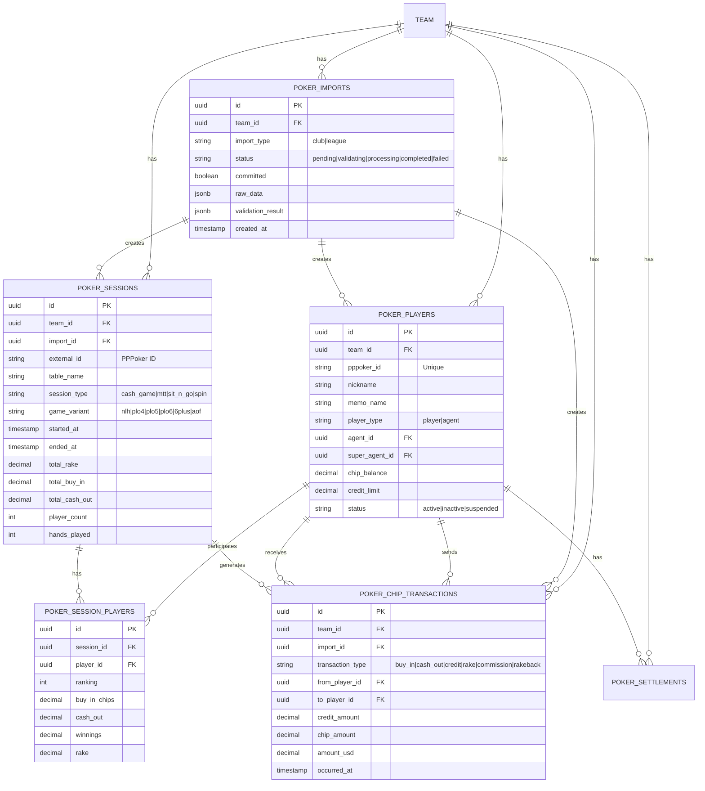

---

## 3. Fluxo tRPC: Request → Response

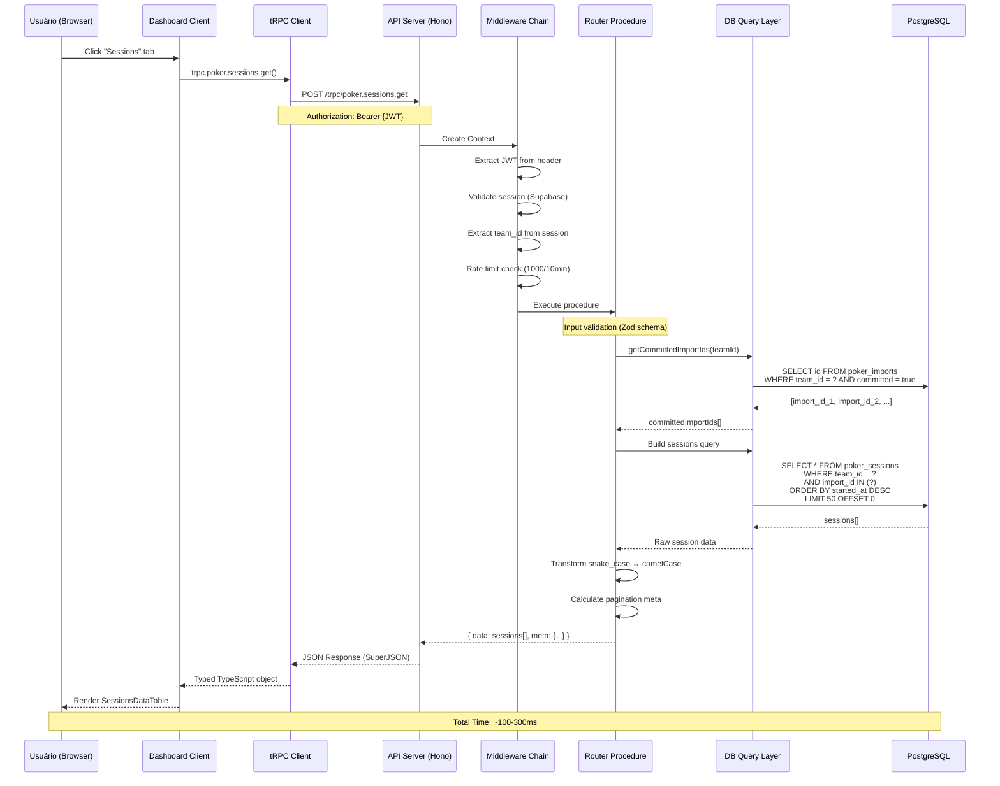

---

## 4. Componentes do Dashboard: Hierarquia

```mermaid
graph TB
    subgraph "Page: /poker"
        A[page.tsx]
        A --> B[PokerWidgetProvider]
        B --> C[PokerDashboardHeader]
        B --> D[PokerWidgetsGrid]

        D --> E1[TotalSessionsWidget]
        D --> E2[TotalPlayersWidget]
        D --> E3[RakeTotalWidget]
        D --> E4[GeneralResultWidget]
        D --> E5[RakeBreakdownWidget]
        D --> E6[TotalRakebackWidget]
        D --> E7[PlayerResultsWidget]
        D --> E8[GameTypesWidget]

        E1 --> F1[useTRPC: poker.sessions.getStats]
        E2 --> F2[useTRPC: poker.players.getStats]
        E3 --> F3[useTRPC: poker.analytics.getRakeTotals]
        E4 --> F4[useTRPC: poker.analytics.getBankResult]
    end

    subgraph "Page: /poker/sessions"
        G[page.tsx]
        G --> H[PokerSessionsHeader]
        G --> I[PokerSessionsStats]
        G --> J[SessionsDataTable]

        H --> K[Filters Dropdown]
        H --> L[Date Range Picker]

        I --> M[useTRPC: poker.sessions.getStats]

        J --> N[useTRPC: poker.sessions.get]
        J --> O[DataTable Row]
        O -->|Click| P[SessionDetailSheet]

        P --> Q[useTRPC: poker.sessions.getById]
        P --> R[Session Players Table]
        P --> S[Rake Breakdown]
    end

    subgraph "Page: /poker/import"
        T[page.tsx]
        T --> U[PokerImportHeader]
        T --> V[ImportUploader]
        T --> W[ImportsList]

        V --> X[File Drop Zone]
        X -->|Upload| Y[useTRPC: poker.imports.upload]
        Y --> Z[Validation Result]
        Z -->|Valid| AA[ImportPreview 10 Tabs]
        AA -->|Approve| AB[useTRPC: poker.imports.process]

        W --> AC[useTRPC: poker.imports.get]
        AC --> AD[Import Card]
        AD -->|Click| AE[Import Detail Modal]
    end

    style A fill:#e3f2fd
    style G fill:#e3f2fd
    style T fill:#e3f2fd
    style F1 fill:#fff3e0
    style F2 fill:#fff3e0
    style F3 fill:#fff3e0
    style F4 fill:#fff3e0
```

---

## 5. Fluxo de Importação: Validação Detalhada

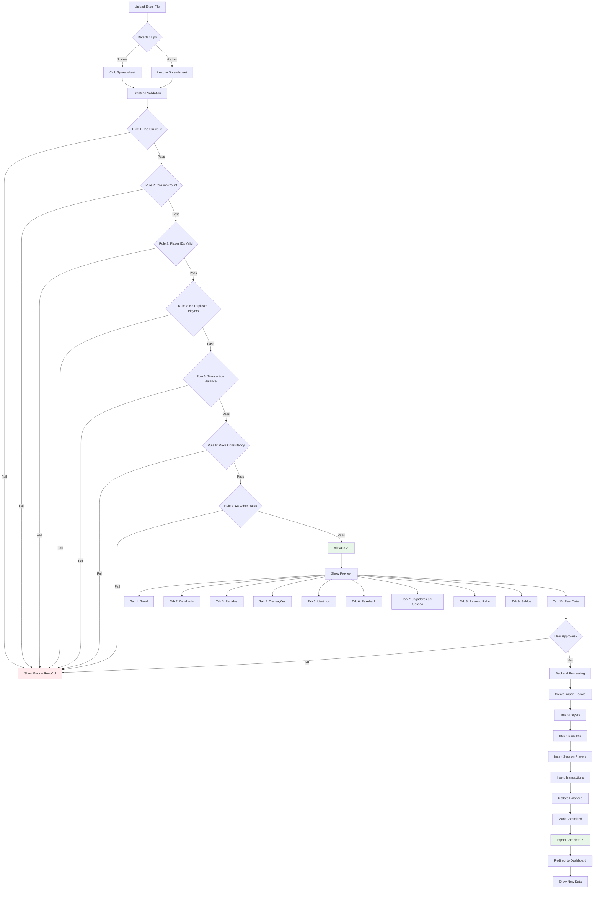

---

## 6. Middleware Chain: Segurança e Performance

```mermaid
graph LR
    A[HTTP Request] --> B[Hono Server]
    B --> C[tRPC Handler]

    C --> D{Context Creation}
    D --> E[Extract JWT from Header]
    E --> F[Validate with Supabase Auth]
    F --> G{Valid Session?}
    G -->|No| H[401 Unauthorized]
    G -->|Yes| I[Extract User + Team]

    I --> J{Middleware 1: Rate Limiting}
    J --> K[Redis: GET rate_limit:user_id]
    K --> L{< 1000 in 10min?}
    L -->|No| M[429 Too Many Requests]
    L -->|Yes| N[Redis: INCR counter]

    N --> O{Middleware 2: Team Permission}
    O --> P[Check team_id in user.teams]
    P --> Q{User in Team?}
    Q -->|No| R[403 Forbidden]
    Q -->|Yes| S[Add team_id to context]

    S --> T{Middleware 3: Primary Read-After-Write}
    T --> U{Is Write Operation?}
    U -->|Yes| V[Force Primary DB]
    U -->|No| W[Allow Replica DB]

    V --> X[Router Procedure]
    W --> X

    X --> Y[Business Logic]
    Y --> Z[Database Query]
    Z --> AA[Transform Response]
    AA --> AB[Return to Client]

    style H fill:#ffebee
    style M fill:#ffebee
    style R fill:#ffebee
    style AB fill:#e8f5e9
```

---

## 7. Estado do Cliente: React Query + Zustand

```mermaid
graph TB
    subgraph "React Query (Server State)"
        A[tRPC Hooks]
        A --> B[useQuery: poker.sessions.get]
        A --> C[useInfiniteQuery: poker.imports.get]
        A --> D[useMutation: poker.sessions.upsert]

        B --> E[Query Cache]
        C --> E
        D --> E

        E --> F[Automatic Refetch]
        E --> G[Stale-While-Revalidate]
        E --> H[Optimistic Updates]
    end

    subgraph "Zustand (Client State)"
        I[Store: usePokerFiltersStore]
        I --> J[dateRange: from, to]
        I --> K[sessionType: cash_game]
        I --> L[gameVariant: nlh]

        M[Store: usePokerUIStore]
        M --> N[sidebarOpen: boolean]
        M --> O[selectedSessionId: string]
        M --> P[activeTab: string]
    end

    subgraph "URL State (nuqs)"
        Q[usePokerSessionParams]
        Q --> R[?dateFrom=2024-01-01]
        Q --> S[?sessionType=mtt]
        Q --> T[?sort=started_at.desc]

        R --> U[Shareable URLs]
        S --> U
        T --> U
    end

    subgraph "Component Integration"
        V[SessionsDataTable]
        V --> B
        V --> Q

        W[SessionFilters]
        W --> I
        W --> Q

        X[SessionDetailSheet]
        X --> M
        X --> Y[useQuery: poker.sessions.getById]
    end

    style E fill:#fff3e0
    style I fill:#e1f5ff
    style Q fill:#f3e5f5
```

---

## 8. Performance: Caching Strategy

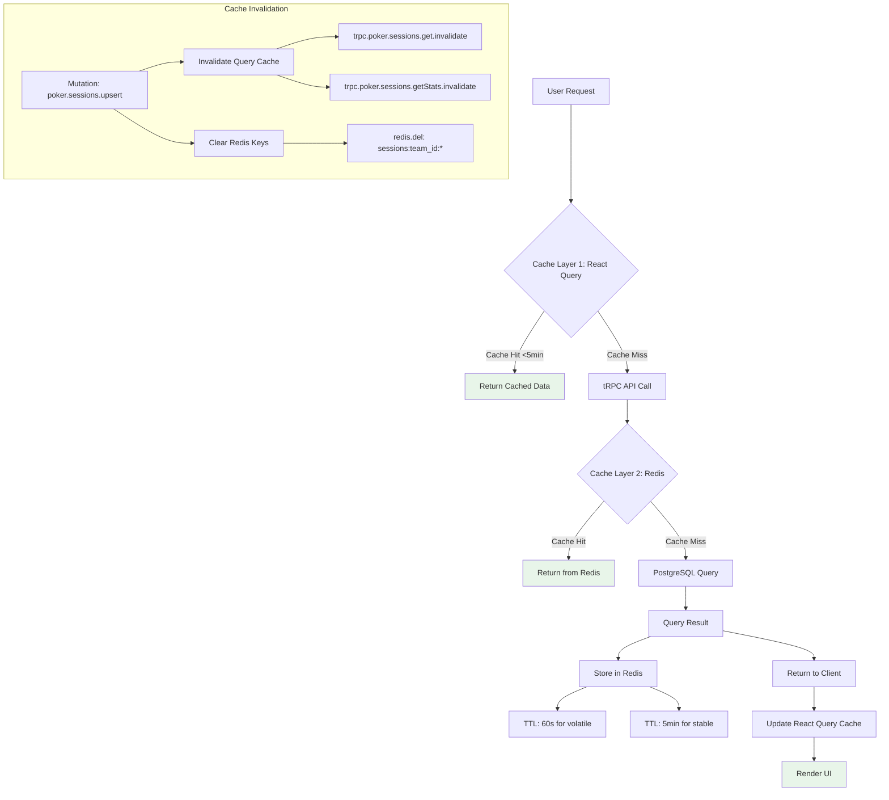

---

## 9. Deploy Architecture: Railway + Supabase

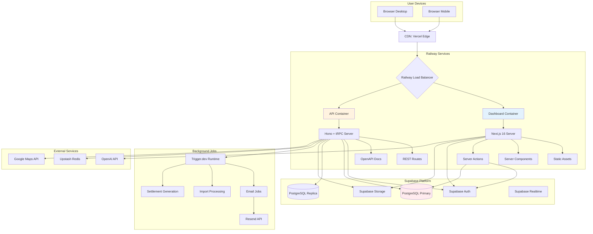

---

## 10. Segurança: Row Level Security (RLS)

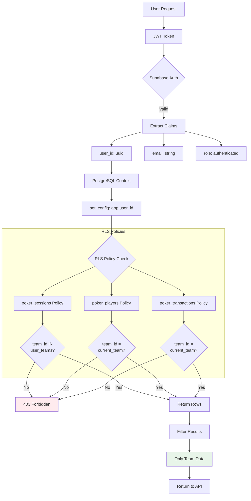

---

## 11. Fluxo de Fechamento de Semana (Week Close Flow)

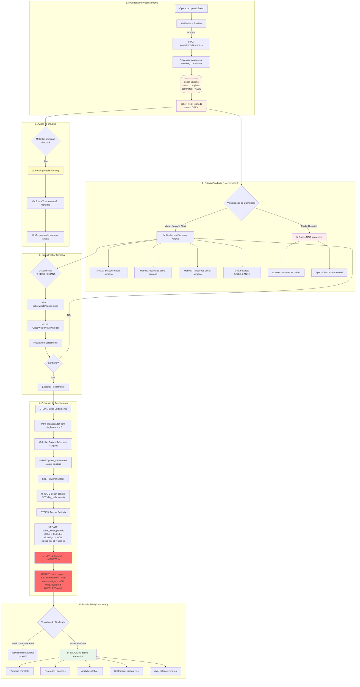

---

## 12. Estados da Importação e Visualização

```mermaid
stateDiagram-v2
    [*] --> Uploading: Upload Excel

    Uploading --> Validating: Parse dados
    Validating --> Failed: Erro de validação
    Validating --> Previewing: Validação OK (12+ regras)

    Failed --> [*]: Usuário cancela

    Previewing --> Processing: Aprovar
    Previewing --> [*]: Rejeitar

    Processing --> Completed: Sucesso
    Processing --> Failed: Erro processamento

    state Completed {
        [*] --> Uncommitted: committed: false

        state Uncommitted {
            note right of Uncommitted
                Estado PENDENTE
                - Dados apenas em "Semana Atual"
                - NÃO aparecem no histórico
                - NÃO entram em analytics globais
                - NÃO somam em timeline
            end note
        }

        Uncommitted --> Committed: FECHAR SEMANA

        state Committed {
            note right of Committed
                Estado FINALIZADO
                - Dados em TODO o sistema
                - Aparecem no histórico
                - Entram em analytics globais
                - Somam na timeline
                - Settlements criados
                - chip_balance zerados
            end note
        }
    }

    Completed --> [*]

    note left of Completed
        CRÍTICO: O campo "committed"
        controla TUDO no sistema!

        committed = false:
        • Isolado na semana aberta
        • Editável/Deletável
        • Saldos acumulando

        committed = true:
        • Global e imutável
        • Settlements criados
        • Saldos zerados
    end note
```

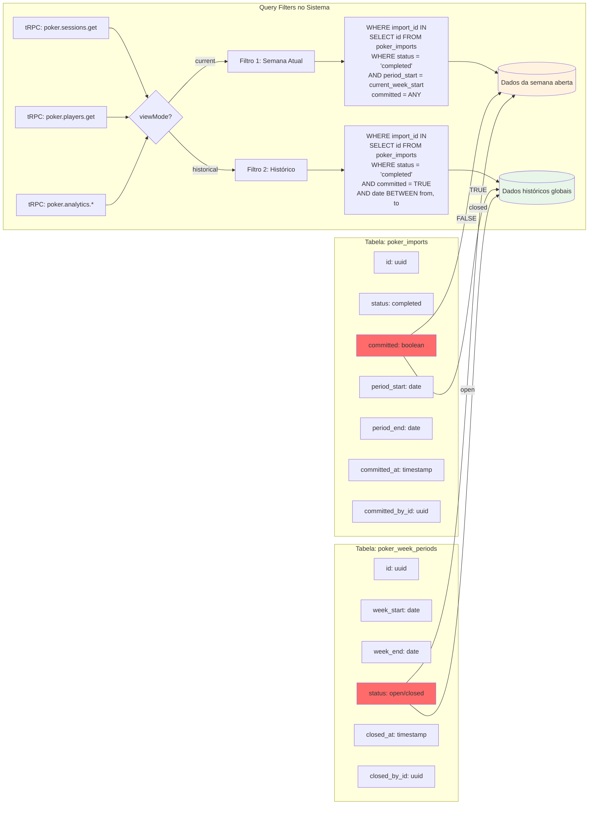

---

## Resumo dos Fluxos Principais

### 1. **Importação** (Diagrama 1, 5, 11)
Operador → Upload Excel → Validação → Preview → Aprovação → Processamento Backend → PostgreSQL (committed: false)

### 2. **Fechamento de Semana** ⭐ (Diagrama 11, 12)
Dados Pendentes → Usuário Clica "Fechar Semana" → Preview Settlements → Confirma → Criar Settlements → Zerar Saldos → Marcar Período Fechado → **COMMIT IMPORTS** → Dados Globais

### 3. **Dashboard** (Diagrama 1, 4, 12)
PostgreSQL → tRPC Widgets → React Query → 8 Widgets → Métricas Agregadas
- **Modo "Semana Atual"**: Apenas imports uncommitted da semana aberta
- **Modo "Histórico"**: Apenas imports committed (semanas fechadas)

### 4. **Sessões** (Diagrama 3, 4, 12)
User Click → tRPC Client → Middleware → Router → DB Query (filtrado por committed) → Transform → DataTable

### 5. **Segurança** (Diagrama 6, 10)
JWT → Middleware Chain → Rate Limit → Team Auth → RLS Policies → Filtered Data

### 6. **Performance** (Diagrama 8)
Request → React Query Cache → Redis Cache → PostgreSQL → Store in Caches → Render

---

**Tecnologias Chave:**
- Frontend: Next.js 16, React 19, tRPC Client, React Query, Zustand
- Backend: Hono, tRPC Server, Drizzle ORM
- Database: PostgreSQL (Supabase) com RLS
- Cache: Redis (Upstash), React Query
- Deploy: Railway (containers), Vercel (CDN)

---

## ⚠️ Conceito Crítico: Campo `committed`

O campo **`poker_imports.committed`** é o controle central do sistema:

### 🔴 `committed: false` (Estado Pendente)
- Importação processada e validada ✅
- Dados salvos no banco ✅
- **MAS**: Isolados na "Semana Atual"
- **NÃO** aparecem em:
  - Relatórios históricos
  - Timeline global
  - Analytics agregados
  - Páginas de sessões/transações (modo histórico)
- Saldos (`chip_balance`) **ACUMULANDO** durante a semana
- Importação **EDITÁVEL/DELETÁVEL**

### 🟢 `committed: true` (Estado Finalizado)
- Marcado ao **FECHAR SEMANA**
- Dados liberados para **TODO o sistema**
- **SIM** aparecem em:
  - Relatórios históricos ✅
  - Timeline global ✅
  - Analytics agregados ✅
  - Todas as páginas ✅
- Saldos (`chip_balance`) **ZERADOS**
- Settlements **CRIADOS**
- Importação **IMUTÁVEL**

### 📊 Queries no Sistema
Todos os routers tRPC filtram por `committed` baseado no contexto:

```typescript
// Modo "Semana Atual" (current)
WHERE import_id IN (
  SELECT id FROM poker_imports
  WHERE status = 'completed'
  AND period_start = current_week_start
  -- committed pode ser true ou false
)

// Modo "Histórico" (historical)
WHERE import_id IN (
  SELECT id FROM poker_imports
  WHERE status = 'completed'
  AND committed = TRUE  -- ⚠️ CRÍTICO
  AND date BETWEEN :from AND :to
)
```

### 🔄 Transição de Estado
A transição `committed: false → true` acontece **APENAS** ao fechar a semana via:
- `tRPC: poker.weekPeriods.close`
- Código: `apps/api/src/trpc/routers/poker/week-periods.ts:1141-1158`

```typescript
// Commit all imports for this week period
await supabase
  .from("poker_imports")
  .update({
    committed: true,
    committed_at: new Date().toISOString(),
    committed_by_id: userId,
  })
  .eq("team_id", teamId)
  .eq("status", "completed")
  .gte("period_start", weekPeriod.week_start)
  .lte("period_end", weekPeriod.week_end);
```

**Esta é a "trava" que separa dados temporários de dados permanentes no sistema!** 🔐
