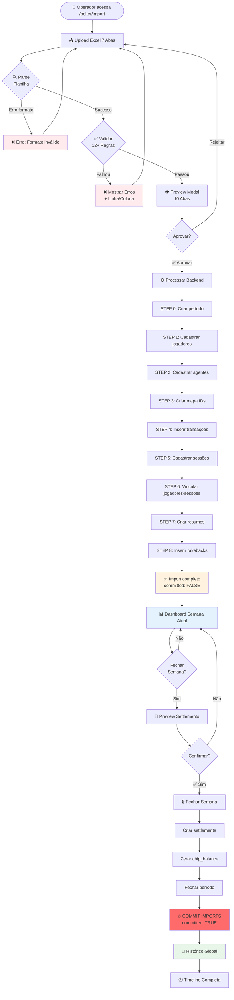

# Fluxo de Importação de Planilha de Clube

**Data:** 2026-01-19
**Tipo:** Documentação de Fluxo UI/UX + Backend
**Módulo:** Poker → Clube (Single Club)

---

## 📋 Visão Geral

Este documento descreve o fluxo completo desde o momento em que um operador de clube faz upload de uma planilha PPPoker até os dados aparecerem no histórico global. O fluxo garante que dados não finalizados fiquem isolados na "Semana Atual" até serem confirmados pelo operador.

---

## 🎯 Conceitos-Chave

### Campo `committed` (Crítico! 🔴)

O campo `poker_imports.committed` controla TODA a visibilidade dos dados no sistema:

| Estado | Valor | Quando | Visibilidade |
|--------|-------|--------|--------------|
| **Pendente** | `false` | Após processar import | ❌ Semana Atual apenas |
| **Finalizado** | `true` | Após fechar semana | ✅ Todo o sistema |

**Por que existe?**
- Permite o operador revisar dados antes de "travar" na timeline
- Evita que dados incompletos/errados apareçam em relatórios
- Separa "rascunho" de "oficial"

---

## 🔄 Fluxo Completo: Passo a Passo



---

## 🖥️ Interface do Usuário: Screenshots Conceituais

### 1️⃣ Página de Import (`/poker/import`)

```
┌────────────────────────────────────────────────────────────┐
│  📂 Importar Planilha de Clube                             │
├────────────────────────────────────────────────────────────┤
│                                                             │
│    ╔═══════════════════════════════════════╗               │
│    ║                                       ║               │
│    ║    📄 Arraste o arquivo Excel aqui   ║               │
│    ║         ou clique para buscar         ║               │
│    ║                                       ║               │
│    ║        Formato: .xlsx (7 abas)        ║               │
│    ╚═══════════════════════════════════════╝               │
│                                                             │
│  ─────────────────────────────────────────────────────     │
│                                                             │
│  📋 Histórico de Importações                               │
│                                                             │
│  ┌──────┬──────────────┬──────────┬───────────┬─────────┐ │
│  │ Data │ Período      │ Status   │ Jogadores │ Ações   │ │
│  ├──────┼──────────────┼──────────┼───────────┼─────────┤ │
│  │ 19/01│ 13/01-19/01  │ ✅ OK    │ 150       │ [Ver]   │ │
│  │ 12/01│ 06/01-12/01  │ ✅ OK    │ 142       │ [Ver]   │ │
│  └──────┴──────────────┴──────────┴───────────┴─────────┘ │
└────────────────────────────────────────────────────────────┘
```

### 2️⃣ Modal de Validação e Preview

```
┌────────────────────────────────────────────────────────────────┐
│  ✅ Validação de Planilha                                   [X]│
├────────────────────────────────────────────────────────────────┤
│                                                                 │
│  📊 Resumo da Validação                                        │
│  ✓ Estrutura: 7 abas detectadas                               │
│  ✓ Colunas: Todas corretas                                     │
│  ✓ IDs de Jogadores: Válidos                                   │
│  ✓ Transações: Balanceadas (R$ 0 diferença)                   │
│  ✓ Rake: Consistente com sessões                               │
│                                                                 │
│  📈 Estatísticas                                               │
│  • Jogadores: 150 (12 novos)                                   │
│  • Sessões: 45                                                 │
│  • Transações: 1.248                                           │
│  • Período: 13/01/2026 - 19/01/2026                           │
│                                                                 │
│  ┌─────────────────────────────────────────────────────────┐  │
│  │ [Geral] [Detalhado] [Partidas] [Transações] [Usuários]  │  │
│  ├─────────────────────────────────────────────────────────┤  │
│  │ ID       │ Apelido      │ Winnings    │ Rake          │  │
│  │ 12345678 │ JogadorA     │ R$ 5.250,00 │ R$ 180,00     │  │
│  │ 87654321 │ AgenteB      │ R$ -1.240   │ R$ 95,00      │  │
│  └─────────────────────────────────────────────────────────┘  │
│                                                                 │
│                      [Rejeitar]  [✅ Aprovar e Processar]      │
└────────────────────────────────────────────────────────────────┘
```

### 3️⃣ Dashboard - Semana Atual (Uncommitted)

```
┌────────────────────────────────────────────────────────────────┐
│  📅 Semana 03 • 13/01 - 19/01 • Status: ABERTA                 │
│  [🔒 Fechar Semana]                                            │
│                                                                 │
│  ┌─────────────────────────┬─────────────────────────┐         │
│  │  [Semana Atual]         │  Histórico              │ ◀──Toggle│
│  └─────────────────────────┴─────────────────────────┘         │
│                                                                 │
│  ⚠️  Dados desta semana ainda não foram finalizados            │
│                                                                 │
│  ┌──────────────┬──────────────┬──────────────┬─────────────┐ │
│  │ 📊 Sessões   │ 👥 Jogadores │ 💰 Rake      │ 🏦 Resultado│ │
│  │              │              │              │             │ │
│  │      45      │     150      │  R$ 12.450   │  R$ 8.320   │ │
│  └──────────────┴──────────────┴──────────────┴─────────────┘ │
│                                                                 │
│  ┌──────────────────────────────────────────────────────────┐  │
│  │  🎮 Sessões da Semana                                    │  │
│  │  Mesa #123 • NLH 1/2 • 8 jogadores • Rake: R$ 280       │  │
│  │  Mesa #124 • PLO 2/5 • 6 jogadores • Rake: R$ 450       │  │
│  └──────────────────────────────────────────────────────────┘  │
└────────────────────────────────────────────────────────────────┘
```

### 4️⃣ Modal de Fechar Semana

```
┌────────────────────────────────────────────────────────────────┐
│  🔒 Fechar Semana - Preview de Acertos                     [X] │
├────────────────────────────────────────────────────────────────┤
│                                                                 │
│  📊 Resumo da Semana                                           │
│  Período: 13/01/2026 - 19/01/2026                             │
│                                                                 │
│  • Total de Jogadores: 150                                     │
│  • Total de Sessões: 45                                        │
│  • Rake Total: R$ 12.450,00                                    │
│  • Acertos a criar: 87 jogadores (com saldo ≠ 0)              │
│                                                                 │
│  ┌─────────────────────────────────────────────────────────┐  │
│  │ Jogador      │ Saldo Bruto │ Rakeback │ Saldo Líquido  │  │
│  ├─────────────────────────────────────────────────────────┤  │
│  │ JogadorA     │  R$ 5.250   │  R$ 262  │  R$ 4.988      │  │
│  │ AgenteB      │  R$ -1.240  │  R$ 0    │  R$ -1.240     │  │
│  │ JogadorC     │  R$ 850     │  R$ 42   │  R$ 808        │  │
│  └─────────────────────────────────────────────────────────┘  │
│                                                                 │
│  ⚠️  ATENÇÃO:                                                  │
│  • Todos os saldos serão ZERADOS                               │
│  • Acertos serão criados com status "Pendente"                 │
│  • Dados serão FINALIZADOS e visíveis no histórico            │
│  • Esta ação NÃO pode ser desfeita                            │
│                                                                 │
│                      [Cancelar]  [🔒 Confirmar Fechamento]     │
└────────────────────────────────────────────────────────────────┘
```

### 5️⃣ Dashboard - Histórico (Committed)

```
┌────────────────────────────────────────────────────────────────┐
│  📜 Histórico de Clubes                                        │
│                                                                 │
│  ┌─────────────────────────┬─────────────────────────┐         │
│  │  Semana Atual           │  [Histórico]            │ ◀──Toggle│
│  └─────────────────────────┴─────────────────────────┘         │
│                                                                 │
│  📅 [13/01/2026 - 19/01/2026 ▼]  [Todo o período ▼]           │
│                                                                 │
│  ┌──────────────┬──────────────┬──────────────┬─────────────┐ │
│  │ 📊 Sessões   │ 👥 Jogadores │ 💰 Rake      │ 🏦 Resultado│ │
│  │              │              │              │             │ │
│  │      380     │     1.245    │  R$ 98.750   │  R$ 65.200  │ │
│  └──────────────┴──────────────┴──────────────┴─────────────┘ │
│                                                                 │
│  🕐 Timeline de Semanas                                        │
│  ┌──────────────────────────────────────────────────────────┐  │
│  │  ✅ Sem 03 (13/01-19/01) • 45 sessões • R$ 12.450       │  │
│  │  ✅ Sem 02 (06/01-12/01) • 38 sessões • R$ 10.200       │  │
│  │  ✅ Sem 01 (30/12-05/01) • 42 sessões • R$ 11.800       │  │
│  └──────────────────────────────────────────────────────────┘  │
└────────────────────────────────────────────────────────────────┘
```

---

## ⚙️ Backend: Operações Técnicas

### Fase 1: Upload e Validação (Frontend)

```typescript
// 1. Parse do Excel (7 abas)
const parsed = parseClubSpreadsheet(file);

// 2. Validação (12+ regras)
const validation = validateClubData(parsed);
// Regras: estrutura, IDs, transações balanceadas, rake consistente, etc.

// 3. Se passou: mostrar preview
if (validation.passed) {
  showPreviewModal(parsed, validation.stats);
}
```

### Fase 2: Processamento (Backend - Aprovado pelo usuário)

```typescript
// tRPC: poker.imports.create
const importRecord = await db.insert(poker_imports).values({
  team_id: teamId,
  file_name: "clube_13-19jan.xlsx",
  status: "processing",
  period_start: "2026-01-13",
  period_end: "2026-01-19",
  raw_data: parsedData,
});

// tRPC: poker.imports.process
// STEP 0: Criar período
await db.insert(poker_week_periods).values({
  week_start: "2026-01-13",
  week_end: "2026-01-19",
  status: "open",
});

// STEP 1-2: Inserir jogadores e agentes
await db.insert(poker_players).values(players); // Batch 500

// STEP 3-4: Inserir transações
await db.insert(poker_chip_transactions).values(transactions); // Batch 500

// STEP 5-6: Inserir sessões e vincular jogadores
await db.insert(poker_sessions).values(sessions);
await db.insert(poker_session_players).values(sessionPlayers);

// STEP 7-8: Resumos e rakebacks
await db.insert(poker_player_summary).values(summaries);
await db.insert(poker_player_rakeback).values(rakebacks);

// FINALIZAR: Marcar como completed MAS uncommitted
await db.update(poker_imports)
  .set({
    status: "completed",
    processed_at: new Date(),
    committed: false, // 🔴 CRÍTICO: Dados não finalizados
  })
  .where(eq(poker_imports.id, importId));
```

### Fase 3: Queries Filtradas por `committed`

```typescript
// Dashboard: Semana Atual (viewMode = "current_week")
const currentWeekImports = await db
  .select({ id: poker_imports.id })
  .from(poker_imports)
  .innerJoin(
    poker_week_periods,
    eq(poker_imports.week_period_id, poker_week_periods.id)
  )
  .where(
    and(
      eq(poker_imports.team_id, teamId),
      eq(poker_imports.status, "completed"),
      eq(poker_week_periods.status, "open")
      // ⚠️ NÃO filtra por committed - pega tudo da semana aberta
    )
  );

// Dashboard: Histórico (viewMode = "historical")
const historicalImports = await db
  .select({ id: poker_imports.id })
  .from(poker_imports)
  .where(
    and(
      eq(poker_imports.team_id, teamId),
      eq(poker_imports.status, "completed"),
      eq(poker_imports.committed, true), // 🔴 CRÍTICO: Apenas finalizados
      between(poker_imports.period_start, fromDate, toDate)
    )
  );

// Usar esses IDs para filtrar sessions, transactions, etc.
const sessions = await db
  .select()
  .from(poker_sessions)
  .where(inArray(poker_sessions.import_id, importIds));
```

### Fase 4: Fechar Semana (Backend)

```typescript
// tRPC: poker.weekPeriods.close
async function closeWeek(weekPeriodId: string) {
  // 1. Buscar jogadores com saldo ≠ 0
  const players = await db
    .select()
    .from(poker_players)
    .where(
      and(
        eq(poker_players.team_id, teamId),
        ne(poker_players.chip_balance, 0)
      )
    );

  // 2. Criar settlements
  const settlements = players.map((player) => ({
    team_id: teamId,
    player_id: player.id,
    period_start: weekPeriod.week_start,
    period_end: weekPeriod.week_end,
    gross_amount: player.chip_balance,
    rakeback_amount: (player.chip_balance * player.rakeback_percentage) / 100,
    net_amount: player.chip_balance - rakeback,
    status: "pending",
  }));

  await db.insert(poker_settlements).values(settlements);

  // 3. Zerar saldos
  await db
    .update(poker_players)
    .set({ chip_balance: 0 })
    .where(inArray(poker_players.id, playerIds));

  // 4. Fechar período
  await db
    .update(poker_week_periods)
    .set({
      status: "closed",
      closed_at: new Date(),
      closed_by_id: userId,
    })
    .where(eq(poker_week_periods.id, weekPeriodId));

  // 5. 🔥 COMMIT IMPORTS 🔥
  await db
    .update(poker_imports)
    .set({
      committed: true, // 🔴 AGORA SIM: Dados finalizados!
      committed_at: new Date(),
      committed_by_id: userId,
    })
    .where(
      and(
        eq(poker_imports.team_id, teamId),
        eq(poker_imports.status, "completed"),
        between(
          poker_imports.period_start,
          weekPeriod.week_start,
          weekPeriod.week_end
        )
      )
    );

  return { success: true, settlementsCreated: settlements.length };
}
```

---

## 🗄️ Estados do Banco de Dados

### Estado 1: Após Processar (Uncommitted)

```sql
-- poker_imports
id: uuid-1234
team_id: team-abc
status: 'completed'
committed: false           ← 🔴 Pendente
committed_at: null
period_start: '2026-01-13'
period_end: '2026-01-19'

-- poker_week_periods
id: period-5678
team_id: team-abc
week_start: '2026-01-13'
week_end: '2026-01-19'
status: 'open'             ← 🔴 Semana aberta

-- poker_players
id: player-001
chip_balance: 5250.00      ← 🔴 Acumulando
```

### Estado 2: Após Fechar Semana (Committed)

```sql
-- poker_imports
id: uuid-1234
team_id: team-abc
status: 'completed'
committed: true            ← ✅ Finalizado!
committed_at: '2026-01-20 10:30:00'
committed_by_id: user-xyz
period_start: '2026-01-13'
period_end: '2026-01-19'

-- poker_week_periods
id: period-5678
team_id: team-abc
week_start: '2026-01-13'
week_end: '2026-01-19'
status: 'closed'           ← ✅ Fechada
closed_at: '2026-01-20 10:30:00'

-- poker_players
id: player-001
chip_balance: 0.00         ← ✅ Zerado

-- poker_settlements (NOVO!)
id: settlement-999
player_id: player-001
period_start: '2026-01-13'
period_end: '2026-01-19'
gross_amount: 5250.00
rakeback_amount: 262.50
net_amount: 4987.50
status: 'pending'
```

---

## 📊 Diagrama de Estados

```mermaid
stateDiagram-v2
    [*] --> Uploading: Upload arquivo

    Uploading --> Validating: Parse Excel
    Validating --> Failed: Erro validação
    Validating --> Previewing: ✅ Validado

    Failed --> [*]: Usuário cancela

    Previewing --> Processing: ✅ Aprovar
    Previewing --> [*]: Rejeitar

    Processing --> Completed: Sucesso
    Processing --> Failed: Erro

    state Completed {
        [*] --> Uncommitted: committed = false

        state Uncommitted {
            note right of Uncommitted
                📊 SEMANA ATUAL
                • Dados isolados
                • Apenas nesta semana
                • chip_balance acumulando
                • Editável/Deletável
            end note
        }

        Uncommitted --> Committed: 🔒 Fechar Semana

        state Committed {
            note right of Committed
                📜 HISTÓRICO GLOBAL
                • Dados finalizados
                • Todo o sistema
                • chip_balance zerados
                • Settlements criados
                • IMUTÁVEL
            end note
        }
    }

    Completed --> [*]
```

---

## 🔍 Queries SQL Exemplo

### Buscar Imports da Semana Atual

```sql
-- Retorna imports da semana aberta (qualquer committed)
SELECT i.*
FROM poker_imports i
INNER JOIN poker_week_periods p ON i.week_period_id = p.id
WHERE i.team_id = 'team-abc'
  AND i.status = 'completed'
  AND p.status = 'open'
ORDER BY i.created_at DESC;
```

### Buscar Imports do Histórico

```sql
-- Retorna APENAS imports committed (finalizados)
SELECT i.*
FROM poker_imports i
WHERE i.team_id = 'team-abc'
  AND i.status = 'completed'
  AND i.committed = true
  AND i.period_start >= '2025-01-01'
  AND i.period_end <= '2026-12-31'
ORDER BY i.period_start DESC;
```

### Buscar Sessões Filtradas por ViewMode

```sql
-- Semana Atual
SELECT s.*
FROM poker_sessions s
WHERE s.team_id = 'team-abc'
  AND s.import_id IN (
    SELECT id FROM poker_imports
    WHERE team_id = 'team-abc'
      AND status = 'completed'
      AND week_period_id = (
        SELECT id FROM poker_week_periods
        WHERE team_id = 'team-abc'
          AND status = 'open'
        ORDER BY week_start DESC
        LIMIT 1
      )
  );

-- Histórico
SELECT s.*
FROM poker_sessions s
WHERE s.team_id = 'team-abc'
  AND s.import_id IN (
    SELECT id FROM poker_imports
    WHERE team_id = 'team-abc'
      AND status = 'completed'
      AND committed = true
      AND period_start >= '2026-01-01'
      AND period_end <= '2026-01-31'
  );
```

---

## ⚡ Performance: Índices Críticos

```sql
-- Índice para queries de semana atual
CREATE INDEX idx_poker_imports_uncommitted
ON poker_imports(team_id, status, week_period_id)
WHERE committed = false;

-- Índice para queries de histórico
CREATE INDEX idx_poker_imports_committed_dates
ON poker_imports(team_id, committed, period_start, period_end)
WHERE committed = true;

-- Índice para sessões por import
CREATE INDEX idx_poker_sessions_import_id
ON poker_sessions(team_id, import_id);
```

---

## 🚨 Pontos de Atenção

### ❌ O que NÃO fazer:

1. **Nunca committar imports manualmente** antes de fechar a semana
2. **Nunca editar imports depois de committed** (dados imutáveis)
3. **Nunca deletar imports committed** (quebra histórico)
4. **Nunca reabrir semanas fechadas** sem rollback adequado

### ✅ Boas Práticas:

1. **Sempre revisar preview** antes de aprovar
2. **Verificar saldos** antes de fechar semana
3. **Confirmar settlements** no preview de fechamento
4. **Usar modo "Semana Atual"** para conferir dados antes de finalizar
5. **Só trocar para "Histórico"** depois de fechar semana

---

## 📚 Arquivos-Chave do Código

| Arquivo | Propósito |
|---------|-----------|
| `apps/dashboard/src/app/[locale]/(app)/(sidebar)/poker/import/page.tsx` | Página de import |
| `apps/dashboard/src/components/poker/import-uploader.tsx` | Uploader + Preview |
| `apps/dashboard/src/components/poker/import-validation-modal.tsx` | Modal de validação |
| `apps/dashboard/src/components/poker/poker-dashboard-header.tsx` | Header com botão fechar |
| `apps/dashboard/src/components/poker/close-week-button.tsx` | Botão fechar semana |
| `apps/dashboard/src/components/poker/close-week-preview-modal.tsx` | Modal de preview |
| `apps/api/src/trpc/routers/poker/imports.ts` | Router de imports |
| `apps/api/src/trpc/routers/poker/week-periods.ts` | Router de períodos |
| `packages/db/migrations/0003_poker_week_periods.sql` | Migration do committed |

---

## 🎓 Resumo para Iniciantes

**Passo 1:** Operador faz upload do Excel → Sistema valida
**Passo 2:** Operador aprova → Dados são processados com `committed: false`
**Passo 3:** Dados aparecem em "Semana Atual" (isolados)
**Passo 4:** Operador clica "Fechar Semana" → Sistema cria settlements + marca `committed: true`
**Passo 5:** Dados aparecem em "Histórico" (global)

**Analogia:** É como um "rascunho" que vira "publicado" quando você clica em "Fechar Semana"!

---

**Última atualização:** 2026-01-19
**Versão:** 1.0
