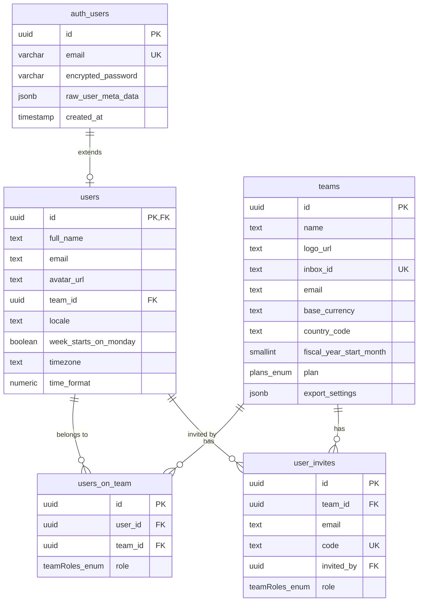
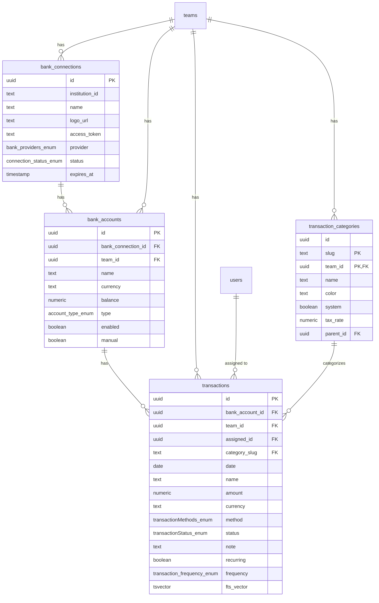
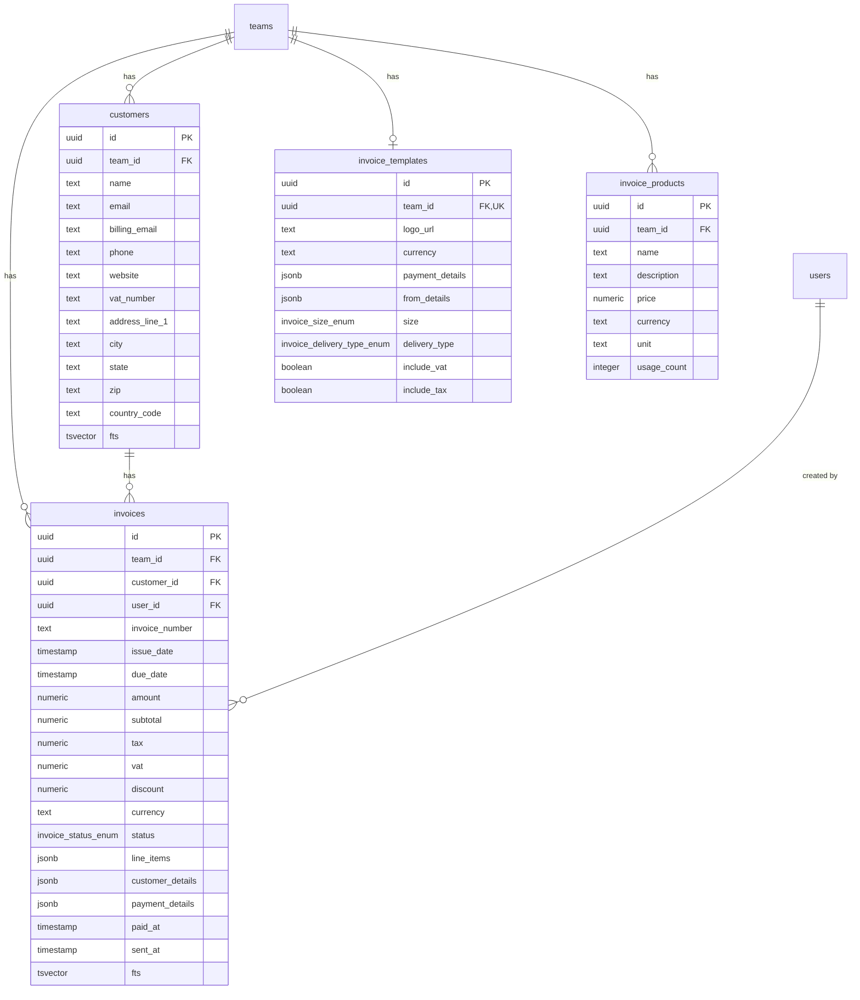
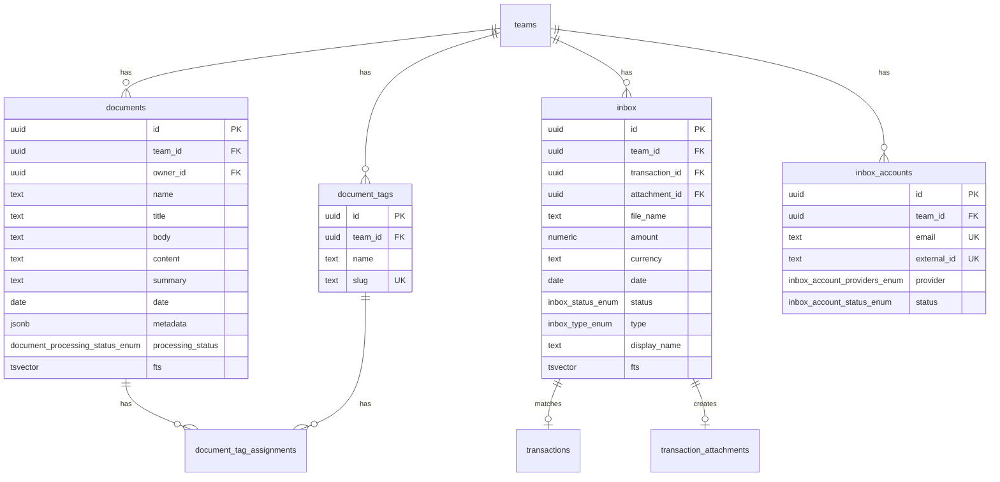
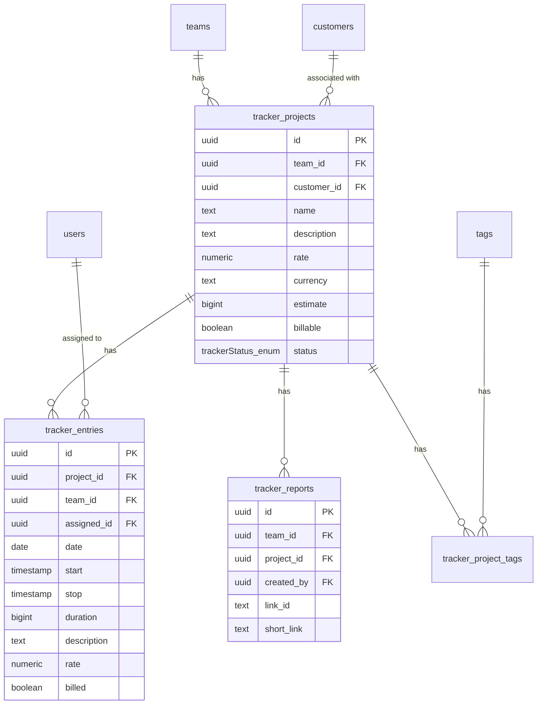
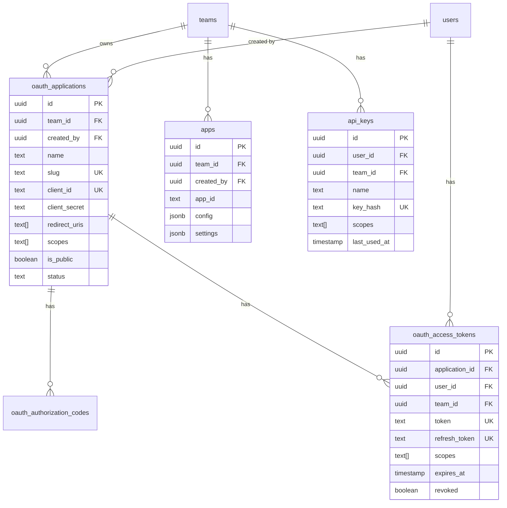
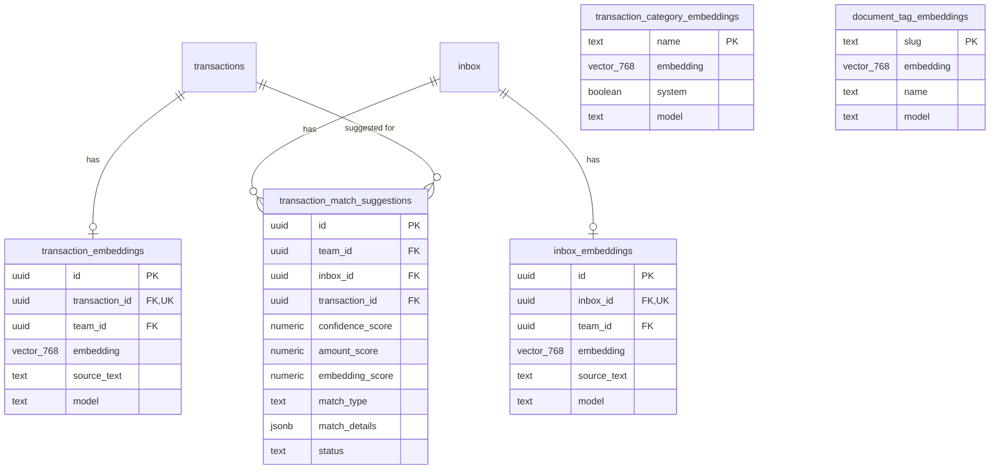

# Mid Poker - Data Model

Este documento descreve o modelo de dados completo da aplicação Mid Poker.

## Visão Geral

O sistema é uma plataforma de gestão financeira empresarial com as seguintes funcionalidades principais:

- **Gestão Financeira**: Contas bancárias, transações, categorização automática
- **Faturamento**: Invoices, clientes, produtos
- **Documentos**: Upload, processamento e classificação de documentos
- **Time Tracking**: Projetos, entradas de tempo, relatórios
- **Inbox Inteligente**: Recebimento e matching automático de notas fiscais
- **Multi-tenancy**: Suporte a múltiplas empresas/times
- **OAuth Provider**: Sistema completo de autenticação para apps terceiros

---

## Diagrama de Entidade-Relacionamento

### Core: Usuários e Times



### Financeiro: Contas e Transações



### Faturamento: Invoices e Clientes



### Documentos e Inbox



### Time Tracking



### OAuth e Integrações



### AI & Embeddings



---

## Enums

### Tipos de Conta
```sql
CREATE TYPE account_type AS ENUM (
  'depository',    -- Conta corrente/poupança
  'credit',        -- Cartão de crédito
  'other_asset',   -- Outros ativos
  'loan',          -- Empréstimos
  'other_liability' -- Outras obrigações
);
```

### Provedores Bancários
```sql
CREATE TYPE bank_providers AS ENUM (
  'gocardless',    -- Open Banking EU
  'plaid',         -- Open Banking US
  'teller',        -- Banking API US
  'enablebanking'  -- Open Banking EU
);
```

### Status de Conexão
```sql
CREATE TYPE connection_status AS ENUM (
  'connected',
  'disconnected',
  'unknown'
);
```

### Métodos de Transação
```sql
CREATE TYPE transactionMethods AS ENUM (
  'payment',
  'card_purchase',
  'card_atm',
  'transfer',
  'ach',
  'wire',
  'interest',
  'deposit',
  'fee',
  'other',
  'unknown'
);
```

### Status de Transação
```sql
CREATE TYPE transactionStatus AS ENUM (
  'posted',    -- Confirmada
  'pending',   -- Pendente
  'excluded',  -- Excluída dos relatórios
  'completed', -- Completa
  'archived'   -- Arquivada
);
```

### Frequência de Transação
```sql
CREATE TYPE transaction_frequency AS ENUM (
  'weekly',
  'biweekly',
  'monthly',
  'semi_monthly',
  'annually',
  'irregular',
  'unknown'
);
```

### Status de Invoice
```sql
CREATE TYPE invoice_status AS ENUM (
  'draft',     -- Rascunho
  'unpaid',    -- Não paga
  'paid',      -- Paga
  'overdue',   -- Vencida
  'canceled',  -- Cancelada
  'scheduled'  -- Agendada
);
```

### Tipo de Entrega de Invoice
```sql
CREATE TYPE invoice_delivery_type AS ENUM (
  'create',          -- Apenas criar
  'create_and_send', -- Criar e enviar
  'scheduled'        -- Envio agendado
);
```

### Status do Inbox
```sql
CREATE TYPE inbox_status AS ENUM (
  'new',              -- Novo item
  'processing',       -- Processando
  'pending',          -- Aguardando ação
  'analyzing',        -- Analisando com AI
  'suggested_match',  -- Match sugerido
  'no_match',         -- Sem match encontrado
  'done',             -- Processado
  'archived',         -- Arquivado
  'deleted'           -- Deletado
);
```

### Tipo de Inbox
```sql
CREATE TYPE inbox_type AS ENUM (
  'invoice',  -- Nota fiscal
  'expense'   -- Comprovante de despesa
);
```

### Status de Processamento de Documento
```sql
CREATE TYPE document_processing_status AS ENUM (
  'pending',
  'processing',
  'completed',
  'failed'
);
```

### Tipos de Atividade
```sql
CREATE TYPE activity_type AS ENUM (
  -- Transações
  'transactions_enriched',
  'transactions_created',
  'transactions_categorized',
  'transactions_assigned',
  'transactions_exported',
  'transaction_attachment_created',
  'transaction_category_created',

  -- Inbox
  'inbox_new',
  'inbox_auto_matched',
  'inbox_needs_review',
  'inbox_cross_currency_matched',
  'inbox_match_confirmed',

  -- Invoices
  'invoice_created',
  'invoice_sent',
  'invoice_paid',
  'invoice_overdue',
  'invoice_duplicated',
  'invoice_scheduled',
  'invoice_reminder_sent',
  'invoice_cancelled',
  'draft_invoice_created',

  -- Documentos
  'document_uploaded',
  'document_processed',

  -- Tracker
  'tracker_entry_created',
  'tracker_project_created',

  -- Clientes
  'customer_created'
);
```

### Planos
```sql
CREATE TYPE plans AS ENUM (
  'trial',   -- Período de teste
  'starter', -- Plano inicial
  'pro'      -- Plano profissional
);
```

### Roles de Time
```sql
CREATE TYPE teamRoles AS ENUM (
  'owner',  -- Proprietário
  'member'  -- Membro
);
```

---

## Índices Importantes

### Full-Text Search
```sql
-- Transações
CREATE INDEX idx_transactions_fts ON transactions USING GIN(fts_vector);

-- Invoices
CREATE INDEX idx_invoices_fts ON invoices USING GIN(fts);

-- Clientes
CREATE INDEX idx_customers_fts ON customers USING GIN(fts);

-- Documentos
CREATE INDEX idx_documents_fts ON documents USING GIN(fts);

-- Inbox
CREATE INDEX idx_inbox_fts ON inbox USING GIN(fts);
```

### Vector Similarity (pgvector)
```sql
-- Embeddings de transações
CREATE INDEX idx_transaction_embeddings_vector
  ON transaction_embeddings
  USING hnsw(embedding vector_cosine_ops);

-- Embeddings de inbox
CREATE INDEX idx_inbox_embeddings_vector
  ON inbox_embeddings
  USING hnsw(embedding vector_cosine_ops);

-- Embeddings de categorias
CREATE INDEX idx_category_embeddings_vector
  ON transaction_category_embeddings
  USING hnsw(embedding vector_cosine_ops);
```

### Performance
```sql
-- Transações por data
CREATE INDEX idx_transactions_team_date
  ON transactions(team_id, date DESC);

-- Transações por nome (busca)
CREATE INDEX idx_transactions_team_name
  ON transactions(team_id, name);

-- Activities (notificações)
CREATE INDEX idx_activities_notifications
  ON activities(team_id, priority, status, created_at DESC);
```

---

## Row-Level Security (RLS)

Todas as tabelas implementam políticas de segurança a nível de linha:

```sql
-- Exemplo: Política para transações
ALTER TABLE transactions ENABLE ROW LEVEL SECURITY;

CREATE POLICY "Users can view transactions from their team"
  ON transactions FOR SELECT
  USING (
    team_id IN (
      SELECT team_id FROM users_on_team
      WHERE user_id = auth.uid()
    )
  );

CREATE POLICY "Users can insert transactions to their team"
  ON transactions FOR INSERT
  WITH CHECK (
    team_id IN (
      SELECT team_id FROM users_on_team
      WHERE user_id = auth.uid()
    )
  );
```

---

## Relacionamentos Chave

| Tabela Pai | Tabela Filha | Tipo | ON DELETE |
|------------|--------------|------|-----------|
| teams | bank_connections | 1:N | CASCADE |
| bank_connections | bank_accounts | 1:N | SET NULL |
| bank_accounts | transactions | 1:N | SET NULL |
| teams | transaction_categories | 1:N | CASCADE |
| transaction_categories | transactions | 1:N | SET NULL |
| teams | customers | 1:N | CASCADE |
| customers | invoices | 1:N | SET NULL |
| teams | tracker_projects | 1:N | CASCADE |
| tracker_projects | tracker_entries | 1:N | CASCADE |
| teams | documents | 1:N | CASCADE |
| inbox | transactions | N:1 | SET NULL |
| oauth_applications | oauth_access_tokens | 1:N | CASCADE |

---

## Estatísticas do Schema

| Métrica | Valor |
|---------|-------|
| Total de Tabelas | 43 |
| Enums | 18 |
| Tabelas com FTS | 6 |
| Tabelas com Embeddings | 5 |
| Índices Vetoriais | 5 |

---

## Considerações de Performance

1. **Particionamento**: Considerar particionar `transactions` por `team_id` e `date` para grandes volumes
2. **Archiving**: Transações antigas podem ser movidas para tabela de arquivo
3. **Embeddings**: Usar índices HNSW para busca vetorial eficiente
4. **FTS**: Todos os campos de busca usam `tsvector` com índices GIN
5. **Conexões**: Pool de conexões via Supabase/pgBouncer

---

*Última atualização: Dezembro 2024*
