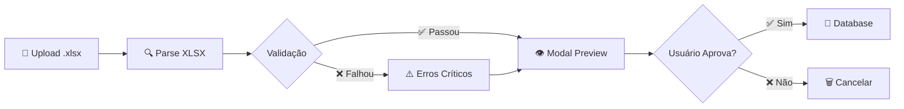
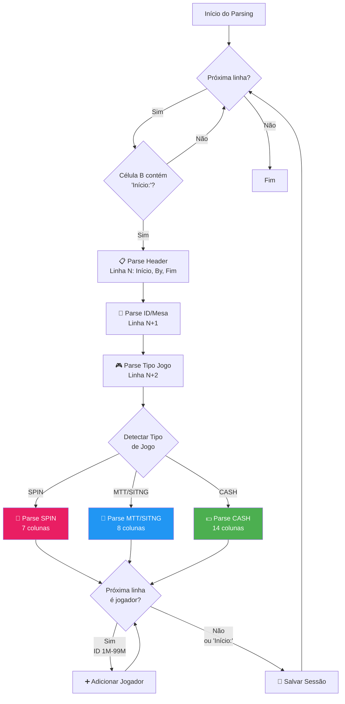
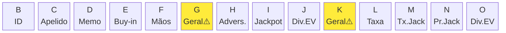
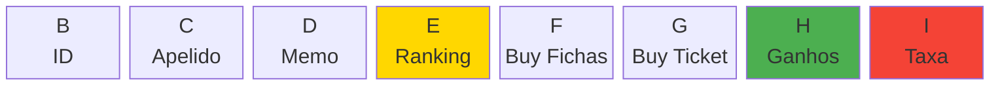
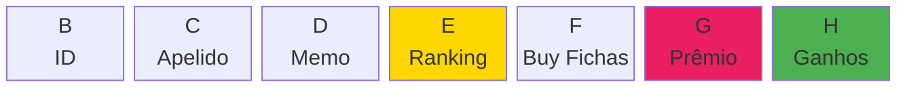
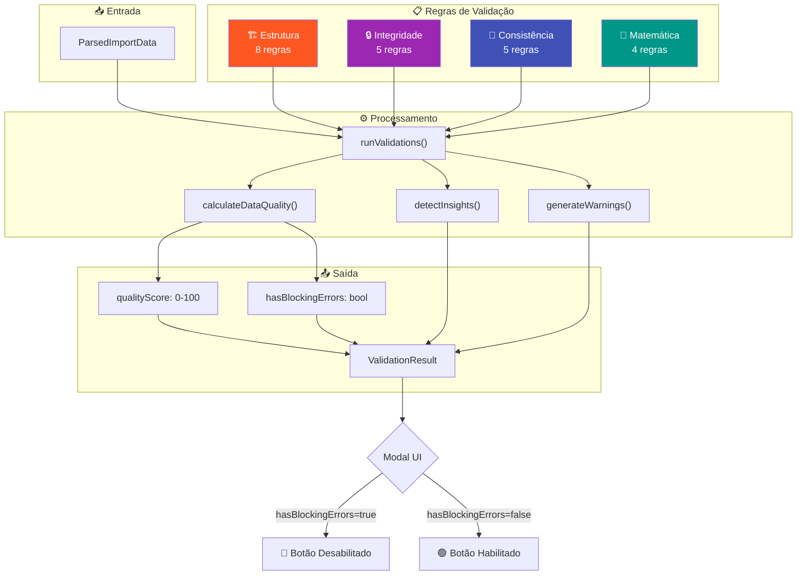
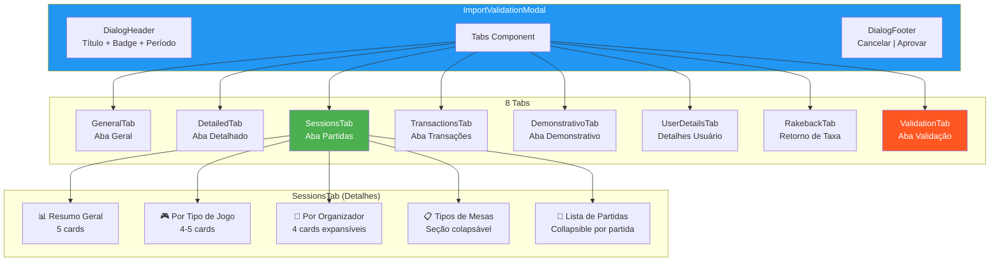

# Documentação do Validador de Importação PPPoker

## Sumário

1. [Visão Geral](#1-visão-geral)
2. [Arquitetura do Sistema](#2-arquitetura-do-sistema)
3. [Fluxo de Dados](#3-fluxo-de-dados)
4. [Tipos de Jogos (CRÍTICO)](#4-tipos-de-jogos-crítico)
5. [Estrutura das Abas da Planilha](#5-estrutura-das-abas-da-planilha)
6. [Parsing da Aba Partidas](#6-parsing-da-aba-partidas)
7. [Sistema de Validação](#7-sistema-de-validação)
8. [Componentes da UI](#8-componentes-da-ui)
9. [Troubleshooting](#9-troubleshooting)
10. [Referência de Arquivos](#10-referência-de-arquivos)

---

## 1. Visão Geral

O sistema de importação processa planilhas Excel do PPPoker, valida os dados e permite que o usuário aprove antes de inserir no banco de dados.

### Fluxo Principal



```
┌─────────────┐    ┌──────────────┐    ┌─────────────────────┐    ┌──────────────┐
│ Upload .xlsx│───▶│ Parse XLSX   │───▶│ Validation Modal    │───▶│ Database     │
│ (dropzone)  │    │ (por aba)    │    │ (8 tabs de preview) │    │ (se aprovado)│
└─────────────┘    └──────────────┘    └─────────────────────┘    └──────────────┘
```

---

## 2. Arquitetura do Sistema

### Arquivos Principais

| Arquivo | Localização | Responsabilidade |
|---------|-------------|------------------|
| `import-uploader.tsx` | `components/poker/` | Parsing do Excel, lógica principal |
| `import-validation-modal.tsx` | `components/poker/` | Modal com 8 abas de preview |
| `types.ts` | `lib/poker/` | Definição de tipos TypeScript |
| `validation.ts` | `lib/poker/` | 17 regras de validação |
| `sessions-tab.tsx` | `components/poker/validation-tabs/` | Tab de Partidas |
| `general-tab.tsx` | `components/poker/validation-tabs/` | Tab Geral |

### Dependências

```typescript
import * as XLSX from "xlsx";           // Parsing Excel
import * as Papa from "papaparse";      // Parsing CSV (fallback)
import { validateImportData } from "@/lib/poker/validation";
```

---

## 3. Fluxo de Dados

### 3.1 Entrada (Upload)

```typescript
// Arquivo: import-uploader.tsx
const onDrop = async (files: File[]) => {
  const file = files[0];
  const workbook = XLSX.read(arrayBuffer, { type: "array" });
  const parsedData = parseExcelWorkbook(workbook, file.name, file.size);
  const validationResult = validateImportData(parsedData);
  // Abre modal de validação
};
```

### 3.2 Estrutura de Dados Parseados

```typescript
interface ParsedImportData {
  players?: ParsedPlayer[];           // Aba "Detalhes do usuário"
  transactions?: ParsedTransaction[]; // Aba "Transações"
  sessions?: ParsedSession[];         // Aba "Partidas"
  summaries?: ParsedSummary[];        // Aba "Geral"
  detailed?: ParsedDetailed[];        // Aba "Detalhado"
  demonstrativo?: ParsedDemonstrativo[]; // Aba "Demonstrativo"
  rakebacks?: ParsedRakeback[];       // Aba "Retorno de taxa"
  periodStart?: string;
  periodEnd?: string;
  sessionsUtcCount?: number;          // Contador de UTC markers
}
```

---

## 4. Tipos de Jogos (CRÍTICO)

### 4.1 Hierarquia de Organizadores

O PPPoker usa prefixos para identificar o organizador da partida:

| Prefixo | Significado | Tipos de Jogo |
|---------|-------------|---------------|
| `PPSR` | PPPoker Ring (Oficial) | Cash Games |
| `PPST` | PPPoker Tournament (Oficial) | MTT, SitNGo, SPIN |
| `Liga` | Interno do Clube | Cash Games ou Torneios |

### 4.2 Categorias de Jogo

```mermaid
graph TD
    subgraph Planilha["📊 Planilha PPPoker"]
        TJ["Tipo do Jogo<br/>(string na célula)"]
    end

    TJ --> DET{Detectar Organizador}

    DET -->|Contém "PPSR"| PPSR["🎰 PPSR<br/>PPPoker Ring<br/>(Oficial)"]
    DET -->|Contém "PPST"| PPST["🏆 PPST<br/>PPPoker Tournament<br/>(Oficial)"]
    DET -->|Nenhum| LIGA["🏠 Liga<br/>Interno do Clube"]

    PPSR --> CASH["💵 CASH<br/>Ring Games"]

    PPST --> PPST_DET{Qual Torneio?}
    PPST_DET -->|Contém "spin"| SPIN["🎡 SPIN<br/>Spinup/Jackpot"]
    PPST_DET -->|Contém "sit/sng"| SITNG["🪑 SITNG<br/>Sit & Go"]
    PPST_DET -->|Default| MTT["🏅 MTT<br/>Multi-Table"]

    LIGA --> LIGA_DET{Qual Tipo?}
    LIGA_DET -->|Torneio detectado| LIGA_T["🏆 Liga Torneio<br/>MTT/SITNG/SPIN"]
    LIGA_DET -->|Default| LIGA_R["💵 Liga Ring<br/>Cash Games"]

    style PPSR fill:#4CAF50,color:white
    style PPST fill:#2196F3,color:white
    style LIGA fill:#FF9800,color:white
    style CASH fill:#8BC34A,color:black
    style MTT fill:#3F51B5,color:white
    style SITNG fill:#673AB7,color:white
    style SPIN fill:#E91E63,color:white
```

```
┌─────────────────────────────────────────────────────────────────┐
│                        TIPOS DE JOGO                            │
├─────────────────────────────────────────────────────────────────┤
│                                                                 │
│  CASH GAMES (Ring Games)                                        │
│  ├── PPSR = PPPoker Ring (oficial)                              │
│  │   └── NLH, PLO4, PLO5, PLO6, OFC, etc.                       │
│  └── Liga Ring = Interno do clube                               │
│      └── Mesmo formato que PPSR                                 │
│                                                                 │
│  TORNEIOS                                                       │
│  ├── PPST = PPPoker Tournament (oficial)                        │
│  │   ├── MTT (Multi-Table Tournament)                           │
│  │   ├── SITNG (Sit & Go)                                       │
│  │   └── SPIN (Spinup - tipo jackpot)                           │
│  └── Liga Torneio = Interno do clube                            │
│      └── MTT, SITNG, SPIN                                       │
│                                                                 │
└─────────────────────────────────────────────────────────────────┘
```

### 4.3 Detecção de Tipo de Jogo

**Arquivo:** `import-uploader.tsx` (linhas 135-228)

```typescript
// 1. Primeiro, detecta o organizador
function getOrganizador(tipoJogo: string): string {
  if (tipoJogo.includes("PPSR")) return "PPSR";  // Cash oficial
  if (tipoJogo.includes("PPST")) return "PPST";  // Torneio oficial
  return "Liga";  // Interno
}

// 2. Depois, detecta o tipo específico
function detectGameType(gameInfo: string): "MTT" | "SITNG" | "SPIN" | "CASH" {
  const info = gameInfo.toLowerCase();

  // PPSR = sempre CASH
  if (info.includes("ppsr")) return "CASH";

  // PPST = Torneio (determinar qual)
  if (info.includes("ppst")) {
    if (info.includes("spin")) return "SPIN";
    if (info.includes("sitng") || info.includes("sit n go") || info.includes("sng")) return "SITNG";
    return "MTT";  // Default para PPST
  }

  // Indicadores adicionais (sem prefixo)
  if (info.includes("spinup") || info.includes("spin")) return "SPIN";
  if (info.includes("sitng") || info.includes("sit n go")) return "SITNG";
  if (info.includes("mtt") || info.includes("freeroll") || info.includes("premiação garantida")) return "MTT";

  return "CASH";  // Default
}
```

### 4.4 Normalização para Badge na UI

**Arquivo:** `sessions-tab.tsx` (linhas 703-723)

```typescript
function formatSessionTypeTag(type: string, organizador?: string | null): "CASH" | "MTT" | "SITNG" | "SPIN" {
  const normalized = formatSessionType(type).toLowerCase();

  // PPST = sempre torneio (nunca CASH)
  if (organizador === "PPST") {
    if (normalized.includes("spin")) return "SPIN";
    if (normalized.includes("sit")) return "SITNG";
    return "MTT";  // Default para PPST
  }

  // PPSR = sempre CASH
  if (organizador === "PPSR") {
    return "CASH";
  }

  // Liga ou outros - usar o tipo detectado
  if (normalized.includes("spin")) return "SPIN";
  if (normalized.includes("mtt")) return "MTT";
  if (normalized.includes("sit")) return "SITNG";
  return "CASH";
}
```

### 4.5 Variantes de Jogo (Game Variants)

| Código | Nome | Descrição |
|--------|------|-----------|
| `nlh` | No Limit Hold'em | Texas Hold'em padrão |
| `nlh_6plus` | Short Deck (6+) | Baralho sem cartas 2-5 |
| `nlh_aof` | All-or-Fold | Formato all-in pré-flop |
| `plo4` | Pot Limit Omaha 4 | Omaha com 4 cartas |
| `plo5` | Pot Limit Omaha 5 | Omaha com 5 cartas |
| `plo6` | Pot Limit Omaha 6 | Omaha com 6 cartas |
| `ofc` | Open Face Chinese | Poker chinês |
| `other` | Outros | FLASH, SEKA, Teen Patti, etc. |

---

## 5. Estrutura das Abas da Planilha

### 5.1 Mapeamento de Abas

| Aba na Planilha | Nome Interno | Colunas | Parser |
|-----------------|--------------|---------|--------|
| Geral | `summaries` | 48 (A-AV) | `parseGeralSheet()` |
| Detalhado | `detailed` | 137 (A-EG) | `parseDetalhadoSheet()` |
| Partidas | `sessions` | Variável | `parsePartidasSheet()` |
| Transações | `transactions` | 21 (A-U) | `parseTransacoesSheet()` |
| Detalhes do usuário | `players` | 12 (A-L) | `parseDetalhesUsuarioSheet()` |
| Demonstrativo | `demonstrativo` | 8 (A-H) | `parseDemonstrativoSheet()` |
| Retorno de taxa | `rakebacks` | 7 (A-G) | `parseRakebackSheet()` |

### 5.2 Aba Geral (48 colunas)

```
┌─────────────────────────────────────────────────────────────────────────────────┐
│ GERAL (Resumo por jogador) - Colunas A até AV                                   │
├─────────────────────────────────────────────────────────────────────────────────┤
│ A-I: Identificação                                                              │
│   B: ID do jogador (ppPokerId)                                                  │
│   C: País/região                                                                │
│   D: Apelido (nickname)                                                         │
│   E: Nome de memorando (memoName)                                               │
│   F-G: Agente (nickname + ID)                                                   │
│   H-I: Superagente (nickname + ID)                                              │
├─────────────────────────────────────────────────────────────────────────────────┤
│ J-N: Classificações                                                             │
│   J: Ganhos de jogador gerais + Eventos                                         │
│   K: Classificação PPSR                                                         │
│   L: Classificação Ring Game                                                    │
│   M: Classificação RG Personalizado                                             │
│   N: Classificação MTT                                                          │
├─────────────────────────────────────────────────────────────────────────────────┤
│ O-X: Ganhos do Jogador                                                          │
│   O: Geral (total)                                                              │
│   P: Ring Games                                                                 │
│   Q: MTT, SitNGo                                                                │
│   R: SPINUP                                                                     │
│   S: Caribbean+ Poker                                                           │
│   T: COLOR GAME                                                                 │
│   U: CRASH                                                                      │
│   V: LUCKY DRAW                                                                 │
│   W: Jackpot                                                                    │
│   X: Dividir EV                                                                 │
├─────────────────────────────────────────────────────────────────────────────────┤
│ Y-AA: Tickets                                                                   │
│   Y: Valor do ticket ganho                                                      │
│   Z: Buy-in de ticket                                                           │
│   AA: Valor do prêmio personalizado                                             │
├─────────────────────────────────────────────────────────────────────────────────┤
│ AB-AG: Taxas                                                                    │
│   AB: Geral (feeGeneral)                                                        │
│   AC: Taxa (fee)                                                                │
│   AD: Taxa (jogos PPST)                                                         │
│   AE: Taxa (jogos não PPST)                                                     │
│   AF: Taxa (jogos PPSR)                                                         │
│   AG: Taxa (jogos não PPSR)                                                     │
├─────────────────────────────────────────────────────────────────────────────────┤
│ AH-AK: SPINUP & Caribbean                                                       │
│ AL-AQ: Ganhos do Clube (Color, Crash, Lucky)                                    │
│ AR-AV: Jackpot e Finais                                                         │
└─────────────────────────────────────────────────────────────────────────────────┘
```

### 5.3 Aba Partidas (Estrutura Especial)

A aba Partidas tem estrutura não-tabular, organizada por blocos de partida:

```
┌─────────────────────────────────────────────────────────────────────────────────┐
│ PARTIDAS - Estrutura por Bloco                                                  │
├─────────────────────────────────────────────────────────────────────────────────┤
│                                                                                 │
│ LINHA N (Header da Partida):                                                    │
│   A: "UTC" (marcador)                                                           │
│   B: "Início: 2024-01-15 14:30"                                                 │
│   C: "By ppNickname(12345678)" ou "By SupervisorMesas(5582707)"                 │
│   D: "Fim: 2024-01-15 16:45"                                                    │
│                                                                                 │
│ LINHA N+1 (Identificação):                                                      │
│   B: "ID do jogo: ABC123"                                                       │
│   C: "Nome da mesa: PLO5 HU 0.5/1"                                              │
│   (Ou ambos na mesma célula B)                                                  │
│                                                                                 │
│ LINHA N+2 (Tipo do Jogo):                                                       │
│   B: "PPST/NLH   Buy-in: 9+1   Premiação Garantida: 1000"                       │
│   OU: "PPSR/PLO5 HU   0.1/0.2   5%   3BB   0.5h"                                │
│                                                                                 │
│ LINHAS N+3...: Dados dos Jogadores (formato varia por tipo)                     │
│                                                                                 │
└─────────────────────────────────────────────────────────────────────────────────┘
```

---

## 6. Parsing da Aba Partidas

### 6.0 Fluxo de Parsing da Aba Partidas



### 6.1 Estrutura de Colunas por Tipo de Jogo

#### CASH / HU (14 colunas)



```
┌─────────────────────────────────────────────────────────────────────────────────┐
│                           CASH / HU - 14 COLUNAS                                │
├───┬───┬───┬───┬───┬───────┬───┬───┬───┬───────┬───┬───┬───┬───┐                 │
│ B │ C │ D │ E │ F │   G   │ H │ I │ J │   K   │ L │ M │ N │ O │                 │
│ID │Ape│Mem│Buy│Mãs│⚠GERAL│Adv│Jck│DEV│⚠GERAL│Tax│TxJ│PrJ│DEV│                 │
├───┴───┴───┴───┴───┼───────┴───┴───┴───┼───────┴───┴───┴───┴───┤                 │
│   IDENTIFICAÇÃO   │  GANHOS JOGADOR   │    GANHOS CLUBE       │                 │
└───────────────────┴───────────────────┴───────────────────────┘                 │
                           │                       │                              │
                    ⚠️ FÓRMULA              ⚠️ FÓRMULA                            │
                    G = H + I + J           K = L + M + N + O                     │
└─────────────────────────────────────────────────────────────────────────────────┘
```

```
┌───┬──────────────────┬──────────────────────────────────────────────────────────┐
│Col│ Campo            │ Descrição                                                │
├───┼──────────────────┼──────────────────────────────────────────────────────────┤
│ B │ ID do jogador    │ ppPokerId (número entre 1M e 99M)                        │
│ C │ Apelido          │ nickname                                                 │
│ D │ Memorando        │ memoName                                                 │
│ E │ Buy-in           │ buyIn (fichas)                                           │
│ F │ Mãos             │ hands jogadas                                            │
├───┼──────────────────┼──────────────────────────────────────────────────────────┤
│   │ GANHOS JOGADOR   │                                                          │
├───┼──────────────────┼──────────────────────────────────────────────────────────┤
│ G │ Geral            │ ⚠️ FÓRMULA - Calcular: H + I + J                         │
│ H │ De adversários   │ winningsOpponents                                        │
│ I │ De Jackpot       │ winningsJackpot                                          │
│ J │ De Dividir EV    │ winningsEvSplit                                          │
├───┼──────────────────┼──────────────────────────────────────────────────────────┤
│   │ GANHOS CLUBE     │                                                          │
├───┼──────────────────┼──────────────────────────────────────────────────────────┤
│ K │ Geral            │ ⚠️ FÓRMULA - Calcular: L + M + N + O                     │
│ L │ Taxa             │ clubWinningsFee (rake)                                   │
│ M │ Taxa do Jackpot  │ clubWinningsJackpotFee                                   │
│ N │ Prêmios Jackpot  │ clubWinningsJackpotPrize                                 │
│ O │ Dividir EV       │ clubWinningsEvSplit                                      │
└───┴──────────────────┴──────────────────────────────────────────────────────────┘
```

**⚠️ IMPORTANTE:** Colunas G e K contêm FÓRMULAS Excel (`=SUM(...)`). O XLSX não calcula fórmulas automaticamente, então precisamos calcular manualmente:

```typescript
// import-uploader.tsx, linhas 517-530
// Ganhos do jogador - Geral é FÓRMULA
const winningsOpponents = toNumber(dataRow[7]);   // H
const winningsJackpot = toNumber(dataRow[8]);     // I
const winningsEvSplit = toNumber(dataRow[9]);     // J
const winningsGeneral = winningsOpponents + winningsJackpot + winningsEvSplit; // Calculado

// Ganhos do clube - Geral é FÓRMULA
const clubTaxa = toNumber(dataRow[11]);           // L
const clubJackpotFee = toNumber(dataRow[12]);     // M
const clubJackpotPrize = toNumber(dataRow[13]);   // N
const clubEvSplit = toNumber(dataRow[14]);        // O
const clubGeneral = clubTaxa + clubJackpotFee + clubJackpotPrize + clubEvSplit; // Calculado
```

#### MTT / SITNG (8 colunas)



```
┌───┬──────────────────┬──────────────────────────────────────────────────────────┐
│Col│ Campo            │ Descrição                                                │
├───┼──────────────────┼──────────────────────────────────────────────────────────┤
│ B │ ID do jogador    │ ppPokerId                                                │
│ C │ Apelido          │ nickname                                                 │
│ D │ Memorando        │ memoName                                                 │
│ E │ Ranking          │ Posição final (#1, #2, etc.)                             │
│ F │ Buy-in Fichas    │ buyInChips                                               │
│ G │ Buy-in Ticket    │ buyInTicket (tickets usados como entrada)                │
│ H │ Ganhos           │ winnings (prêmio recebido)                               │
│ I │ Taxa             │ rake                                                     │
└───┴──────────────────┴──────────────────────────────────────────────────────────┘
```

#### SPIN (7 colunas)



```
┌───┬──────────────────┬──────────────────────────────────────────────────────────┐
│Col│ Campo            │ Descrição                                                │
├───┼──────────────────┼──────────────────────────────────────────────────────────┤
│ B │ ID do jogador    │ ppPokerId                                                │
│ C │ Apelido          │ nickname                                                 │
│ D │ Memorando        │ memoName                                                 │
│ E │ Ranking          │ Posição final                                            │
│ F │ Buy-in Fichas    │ buyInChips                                               │
│ G │ Prêmio           │ prize (NÃO é Buy-in Ticket!)                             │
│ H │ Ganhos           │ winnings                                                 │
└───┴──────────────────┴──────────────────────────────────────────────────────────┘

⚠️ SPIN não tem coluna Taxa!
```

### 6.2 Comparação Visual dos 3 Tipos

```mermaid
gantt
    title Colunas por Tipo de Jogo
    dateFormat X
    axisFormat %s

    section CASH (14 cols)
    ID/Apelido/Memo :a1, 0, 3
    Buy-in/Mãos :a2, 3, 2
    Ganhos Jogador (4) :a3, 5, 4
    Ganhos Clube (5) :a4, 9, 5

    section MTT/SITNG (8 cols)
    ID/Apelido/Memo :b1, 0, 3
    Ranking :b2, 3, 1
    Buy-in (2) :b3, 4, 2
    Ganhos/Taxa :b4, 6, 2

    section SPIN (7 cols)
    ID/Apelido/Memo :c1, 0, 3
    Ranking :c2, 3, 1
    Buy-in :c3, 4, 1
    Prêmio/Ganhos :c4, 5, 2
```



### 6.3 Detecção de Linha de Jogador

```typescript
// import-uploader.tsx, linhas 231-238
function isPlayerRow(row: Array<string | number | null>): boolean {
  const playerId = row[1];  // Coluna B
  return (
    typeof playerId === "number" &&
    playerId >= 1000000 &&     // Mínimo 1 milhão
    playerId <= 99999999       // Máximo 99 milhões
  );
}
```

### 6.4 Contagem de UTC (Validação)

O sistema conta quantos marcadores "UTC" existem na coluna A (combinados com "Início:" na coluna B) para validar se todas as partidas foram parseadas:

```typescript
// import-uploader.tsx, linhas 296-305
let utcCount = 0;
for (const row of rows) {
  const cellA = row[0];
  const cellB = row[1];
  if (cellA && String(cellA).includes("UTC") && cellB && String(cellB).includes("Início:")) {
    utcCount += 1;
  }
}
```

**Na UI (sessions-tab.tsx):**
- ✅ Verde: `utcCount === sessions.length`
- ❌ Vermelho: Números não batem (partidas faltando ou extras)

---

## 7. Sistema de Validação

### 7.0 Fluxo de Validação



### 7.1 Categorias de Validação

| Categoria | Severidade | Bloqueia Aprovação? |
|-----------|------------|---------------------|
| `structure` | critical | ✅ Sim |
| `integrity` | critical | ✅ Sim |
| `consistency` | critical/warning | ✅ Se critical |
| `math` | critical/warning | ✅ Se critical |

### 7.2 Lista Completa de Validações

**Arquivo:** `lib/poker/validation.ts`

```typescript
// ESTRUTURA (8 regras)
geral_sheet_present          // Aba Geral existe e tem dados
geral_columns_complete       // 48 colunas presentes
detalhado_sheet_present      // Aba Detalhado existe
transactions_sheet_present   // Aba Transações existe (21 cols)
user_details_sheet_present   // Aba Detalhes do usuário existe (12 cols)
partidas_sheet_present       // Aba Partidas existe
rakeback_sheet_present       // Aba Retorno de taxa existe (warning)
period_detected              // Período identificado (max 31 dias)

// INTEGRIDADE (5 regras)
player_ids_valid             // IDs são numéricos válidos
numeric_values_valid         // Valores monetários são números
dates_valid                  // Datas podem ser parseadas
no_duplicate_transactions    // Sem transações duplicadas
no_empty_nicknames           // Todos jogadores têm apelido

// CONSISTÊNCIA (5 regras)
player_count_consistent      // Geral e Detalhado têm mesma qtd (±5%)
player_ids_match_between_sheets  // IDs batem entre abas
win_loss_distribution_valid  // Soma zero + rake (poker math)
user_details_players_in_geral    // Detalhes do usuário ⊆ Geral
agents_have_rakeback         // Agentes têm dados de rakeback

// MATEMÁTICA (4 regras)
game_totals_sum_to_general   // Ring + MTT + SPIN + ... = Geral
fee_totals_valid             // Taxa PPST + não-PPST = Taxa total
partidas_values_valid        // Buy-ins positivos, valores coerentes
transaction_balances_coherent // Entradas/saídas de crédito coerentes
```

### 7.3 Cálculo do Score de Qualidade

```typescript
// validation.ts, linhas 607-623
function calculateDataQuality(checks: ValidationCheck[]) {
  const total = checks.length;
  const passed = checks.filter((c) => c.status === "passed").length;
  const warnings = checks.filter((c) => c.status === "warning").length;

  // passed = 100%, warning = 50%, failed = 0%
  const score = Math.round(((passed * 100) + (warnings * 50)) / total);

  return {
    score: Math.min(100, score),
    passed,
    total,
    criticalFailed: checks.filter((c) => c.status === "failed").length,
  };
}
```

### 7.4 Bloqueio de Aprovação

```typescript
// validation.ts, linha 915
const hasBlockingErrors = quality.criticalFailed > 0;
```

Se `hasBlockingErrors === true`:
- Botão "Aprovar" fica desabilitado
- Badge mostra "Bloqueado" em vermelho
- Usuário precisa corrigir a planilha

---

## 8. Componentes da UI

### 8.0 Estrutura de Componentes



### 8.1 Modal de Validação

**Arquivo:** `import-validation-modal.tsx`

```typescript
<Dialog open={open} onOpenChange={onOpenChange}>
  <DialogContent className="max-w-[95vw] w-[1600px]">
    <DialogHeader>
      {/* Título + Badge de qualidade + Período */}
    </DialogHeader>

    <Tabs value={activeTab} onValueChange={setActiveTab}>
      <TabsList>
        <TabsTrigger value="general">Geral ({count})</TabsTrigger>
        <TabsTrigger value="detailed">Detalhado ({count})</TabsTrigger>
        <TabsTrigger value="sessions">Partidas ({count})</TabsTrigger>
        <TabsTrigger value="transactions">Transações ({count})</TabsTrigger>
        <TabsTrigger value="demonstrativo">Demonstrativo ({count})</TabsTrigger>
        <TabsTrigger value="user-details">Detalhes do usuário ({count})</TabsTrigger>
        <TabsTrigger value="rakeback">Retorno de taxa ({count})</TabsTrigger>
        <TabsTrigger value="validation">Validação ({passed}/{total})</TabsTrigger>
      </TabsList>

      {/* TabsContent para cada aba */}
    </Tabs>

    <DialogFooter>
      <Button onClick={onReject}>Cancelar</Button>
      <Button onClick={onApprove} disabled={hasBlockingErrors}>
        Aprovar e Processar
      </Button>
    </DialogFooter>
  </DialogContent>
</Dialog>
```

### 8.2 Tab de Partidas (Sessions)

**Arquivo:** `sessions-tab.tsx`

#### Seções de Cards

```
┌─────────────────────────────────────────────────────────────────────────────────┐
│ RESUMO GERAL (5 cards)                                                          │
│ [Partidas] [Jogadores] [Total Ganhos] [Buy-in Total] [Taxa Total]               │
├─────────────────────────────────────────────────────────────────────────────────┤
│ POR TIPO DE JOGO (4-5 cards)                                                    │
│ [Cash Games] [Torneios] [Mãos Jogadas ▼] [GTD Total*] [Mesas HU ▼]              │
│                          └─ Expansível     └─ Só se > 0   └─ Expansível         │
├─────────────────────────────────────────────────────────────────────────────────┤
│ POR ORGANIZADOR (4 cards expansíveis)                                           │
│ [PPST ▼] [PPSR ▼] [Liga Torneios ▼] [Liga Ring ▼]                               │
│   └─ MTT/SITNG/SPIN breakdown + Buy-in + Taxa                                   │
├─────────────────────────────────────────────────────────────────────────────────┤
│ TIPOS DE MESAS (seção colapsável)                                               │
│ [Mesa 1 (N partidas)] [Mesa 2 (N partidas)] ...                                 │
└─────────────────────────────────────────────────────────────────────────────────┘
```

#### Cálculos Importantes

```typescript
// Mãos por organizador
const ppsrHands = ppsrSessions.reduce((sum, s) => sum + (s.handsPlayed ?? 0), 0);
const ligaRingHands = ligaSessions
  .filter((s) => formatSessionTypeTag(s.sessionType, "Liga") === "CASH")
  .reduce((sum, s) => sum + (s.handsPlayed ?? 0), 0);
const huHands = huSessions.reduce((sum, s) => sum + (s.handsPlayed ?? 0), 0);

// GTD (Garantido) - apenas MTT e SITNG
const tournamentsWithGTD = sessions.filter((s) => {
  const type = formatSessionTypeTag(s.sessionType, s.createdByNickname);
  return (type === "MTT" || type === "SITNG") && (s.guaranteedPrize ?? 0) > 0;
});
const totalGTD = tournamentsWithGTD.reduce((sum, s) => sum + (s.guaranteedPrize ?? 0), 0);
```

---

## 9. Troubleshooting

### 9.0 Árvore de Decisão para Debug

```mermaid
flowchart TD
    START["🐛 Bug Detectado"] --> Q1{"Qual o problema?"}

    Q1 -->|Badge errada| BADGE["Badge CASH/MTT/SPIN/SITNG errada"]
    Q1 -->|Valores R$ 0| ZERO["Valores mostrando R$ 0,00"]
    Q1 -->|Valores deslocados| SHIFT["Colunas estão erradas"]
    Q1 -->|Partidas faltando| MISSING["UTC count não bate"]
    Q1 -->|Validação falha| VALID["Erro de validação"]

    BADGE --> B1{"Organizador está<br/>sendo passado?"}
    B1 -->|Não| FIX_B1["Passar organizador para<br/>formatSessionTypeTag()"]
    B1 -->|Sim| B2{"Organizador é<br/>PPST/PPSR/Liga?"}
    B2 -->|Errado| FIX_B2["Verificar getOrganizador()<br/>e detectGameType()"]

    ZERO --> Z1{"Qual coluna?"}
    Z1 -->|Geral (G ou K)| FIX_Z1["⚠️ FÓRMULA EXCEL<br/>Calcular: G=H+I+J, K=L+M+N+O"]
    Z1 -->|Outra coluna| FIX_Z2["Verificar toNumber()<br/>e índice da coluna"]

    SHIFT --> S1{"Qual tipo?"}
    S1 -->|CASH| FIX_S1["Verificar índices 4-14<br/>em CASH parsing"]
    S1 -->|MTT/SITNG| FIX_S2["Verificar índices 4-8<br/>em MTT parsing"]
    S1 -->|SPIN| FIX_S3["Verificar índices 4-7<br/>em SPIN parsing"]

    MISSING --> M1["Verificar marcadores UTC<br/>na coluna A da planilha"]
    M1 --> M2["Verificar se 'Início:'<br/>está na coluna B"]

    VALID --> V1{"Qual regra?"}
    V1 -->|game_totals_sum| FIX_V1["Ring + MTT + SPIN +<br/>Caribbean + ... = Geral"]
    V1 -->|player_count| FIX_V2["Comparar Geral vs Detalhado"]
    V1 -->|fee_totals| FIX_V3["PPST + não-PPST = Taxa"]

    style FIX_Z1 fill:#FFEB3B,color:black
    style FIX_B1 fill:#4CAF50,color:white
```

### 9.1 Erro: "PPST detectado como CASH"

**Causa:** O organizador não está sendo passado para `formatSessionTypeTag()`.

**Solução:**
```typescript
// ❌ Errado
formatSessionTypeTag(s.sessionType)

// ✅ Correto
formatSessionTypeTag(s.sessionType, s.createdByNickname)
```

### 9.2 Erro: "Geral mostra R$ 0,00 para CASH"

**Causa:** Colunas G e K da aba Partidas contêm fórmulas Excel que não são calculadas pelo XLSX.

**Solução:** Calcular os valores manualmente:
```typescript
// Geral do jogador = De adversários + De Jackpot + De Dividir EV
const winningsGeneral = winningsOpponents + winningsJackpot + winningsEvSplit;

// Geral do clube = Taxa + Taxa Jackpot + Prêmios Jackpot + Dividir EV
const clubGeneral = clubTaxa + clubJackpotFee + clubJackpotPrize + clubEvSplit;
```

### 9.3 Erro: "Valores de CASH estão deslocados"

**Causa:** Índices de coluna errados no parsing.

**Verificar mapeamento:**
```
Índice 4  = E = Buy-in
Índice 5  = F = Mãos
Índice 6  = G = Geral (jogador) - FÓRMULA
Índice 7  = H = De adversários
Índice 8  = I = De Jackpot
Índice 9  = J = De Dividir EV
Índice 10 = K = Geral (clube) - FÓRMULA
Índice 11 = L = Taxa
Índice 12 = M = Taxa do Jackpot
Índice 13 = N = Prêmios Jackpot
Índice 14 = O = Dividir EV
```

### 9.4 Erro: "Cannot access 'X' before initialization"

**Causa:** Variável usada antes de ser declarada (ordem de declaração errada).

**Solução:** Mover a declaração para DEPOIS das dependências.

### 9.5 Erro: "UTC count não bate"

**Causa:** Algumas partidas não foram parseadas ou marcadores UTC extras.

**Debug:**
1. Verificar se todas as partidas têm "UTC" na coluna A E "Início:" na coluna B
2. Verificar se o loop de parsing está encontrando todas as linhas com "Início:"
3. Verificar se `isPlayerRow()` está identificando corretamente os jogadores

### 9.6 Erro: "Validação falha em 'game_totals_sum_to_general'"

**Causa:** Soma dos tipos de jogo não bate com o total geral.

**Fórmula esperada:**
```
Ring Games + MTT/SitNGo + SPINUP + Caribbean + Color Game +
Crash + Lucky Draw + Jackpot + Dividir EV = Geral (Total)
```

**Tolerância:** R$ 0,10 por arredondamento

---

## 10. Referência de Arquivos

### Estrutura de Diretórios

```
apps/dashboard/src/
├── components/poker/
│   ├── import-uploader.tsx          # Parser principal (1800+ linhas)
│   ├── import-validation-modal.tsx  # Modal com 8 tabs
│   └── validation-tabs/
│       ├── index.ts                 # Exports
│       ├── general-tab.tsx          # Tab Geral
│       ├── detailed-tab.tsx         # Tab Detalhado
│       ├── sessions-tab.tsx         # Tab Partidas
│       ├── transactions-tab.tsx     # Tab Transações
│       ├── demonstrativo-tab.tsx    # Tab Demonstrativo
│       ├── user-details-tab.tsx     # Tab Detalhes do usuário
│       ├── rakeback-tab.tsx         # Tab Retorno de taxa
│       └── validation-tab.tsx       # Tab Validação
├── lib/poker/
│   ├── types.ts                     # Tipos TypeScript (526 linhas)
│   └── validation.ts                # Regras de validação (1076 linhas)
└── locales/
    ├── en.ts                        # Traduções EN
    └── pt.ts                        # Traduções PT

docs/
├── Planilha_Basica_PPP/             # Mapeamentos das abas
│   ├── mapeamento-aba-geral.md
│   ├── mapeamento-aba-detalhado.md
│   ├── mapeamento-aba-transacoes.md
│   ├── mapeamento-aba-detalhes-usuario.md
│   ├── mapeamento-aba-demonstrativo.md
│   └── mapeamento-aba-retorno-taxa.md
└── POKER_IMPORT_VALIDATION_DOCS.md  # Este arquivo
```

### Linhas Importantes

| Arquivo | Linhas | Descrição |
|---------|--------|-----------|
| `import-uploader.tsx` | 135-157 | `normalizeSessionType()` |
| `import-uploader.tsx` | 173-228 | `detectGameType()` |
| `import-uploader.tsx` | 289-595 | `parsePartidasSheet()` |
| `import-uploader.tsx` | 459-561 | Parsing de jogadores por tipo |
| `import-uploader.tsx` | 597-662 | `GERAL_COLUMNS` mapeamento |
| `import-uploader.tsx` | 998-1173 | `DETALHADO_COLUMNS` mapeamento |
| `sessions-tab.tsx` | 703-723 | `formatSessionTypeTag()` |
| `validation.ts` | 37-212 | Regras de estrutura |
| `validation.ts` | 218-305 | Regras de integridade |
| `validation.ts` | 311-439 | Regras de consistência |
| `validation.ts` | 445-560 | Regras matemáticas |
| `validation.ts` | 791-973 | `validateImportData()` principal |

---

## Changelog

| Data | Alteração |
|------|-----------|
| 2024-12-21 | Documentação inicial criada |
| 2024-12-21 | Fix: PPST detectado como CASH (organizador) |
| 2024-12-21 | Fix: Geral CASH R$0 (fórmulas Excel) |
| 2024-12-21 | Adicionado card GTD Total |
| 2024-12-21 | Reorganização dos cards de resumo |
| 2024-12-21 | Adicionado card Mãos Jogadas expansível |
