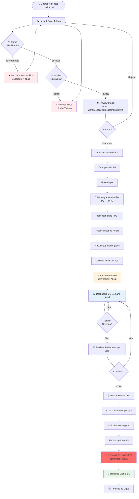

# Fluxo de Importação de Planilha SU (SuperUnion/Liga)

**Data:** 2026-01-19
**Tipo:** Documentação de Fluxo UI/UX + Backend
**Módulo:** Poker → SU (SuperUnion / Liga)

---

## 📋 Visão Geral

Este documento descreve o fluxo completo de importação de planilhas de **SuperUnion (SU)** ou **Liga**, desde o upload até a finalização no histórico. Diferente do fluxo de Clube (single club), este fluxo trabalha com **múltiplas ligas** agregadas, separando dados de **PPST (torneios)** e **PPSR (cash games)**.

---

## 🎯 Conceitos-Chave

### Campo `committed` (Crítico! 🔴)

O campo `poker_su_imports.committed` controla TODA a visibilidade dos dados no sistema:

| Estado | Valor | Quando | Visibilidade |
|--------|-------|--------|--------------|
| **Pendente** | `false` | Após processar import | ❌ Semana Atual apenas |
| **Finalizado** | `true` | Após fechar semana | ✅ Todo o sistema |

**Por que existe?**
- Permite revisar dados agregados de MÚLTIPLAS ligas antes de finalizar
- Evita que dados de ligas incompletas apareçam em relatórios
- Separa "rascunho" de "oficial" no contexto de SuperUnion

### Diferenças vs. Clube

| Aspecto | Clube | SU/Liga |
|---------|-------|---------|
| **Abas** | 7 | 4 |
| **Escopo** | Single club | Múltiplas ligas |
| **Jogos** | Unified | PPST (torneios) + PPSR (cash) |
| **Métricas** | Rake | Ganhos da Liga, Gap Garantido |
| **Settlements** | Por jogador | Por liga |
| **Tabelas** | `poker_*` | `poker_su_*` |

---

## 🔄 Fluxo Completo: Passo a Passo



---

## 🖥️ Interface do Usuário: Screenshots Conceituais

### 1️⃣ Página de Import SU (`/su/import`)

```
┌────────────────────────────────────────────────────────────┐
│  🏆 Importar Planilha de SuperUnion / Liga                 │
├────────────────────────────────────────────────────────────┤
│                                                             │
│    ╔═══════════════════════════════════════╗               │
│    ║                                       ║               │
│    ║    📄 Arraste o arquivo Excel aqui   ║               │
│    ║         ou clique para buscar         ║               │
│    ║                                       ║               │
│    ║        Formato: .xlsx (4 abas)        ║               │
│    ║    Geral PPST | Jogos PPST           ║               │
│    ║    Geral PPSR | Jogos PPSR           ║               │
│    ╚═══════════════════════════════════════╝               │
│                                                             │
│  ─────────────────────────────────────────────────────     │
│                                                             │
│  📋 Histórico de Importações SU                            │
│                                                             │
│  ┌──────┬──────────────┬──────────┬─────────┬───────────┐ │
│  │ Data │ Período      │ Status   │ Ligas   │ Ações     │ │
│  ├──────┼──────────────┼──────────┼─────────┼───────────┤ │
│  │ 19/01│ 13/01-19/01  │ ✅ OK    │ 8 ligas │ [Ver]     │ │
│  │ 12/01│ 06/01-12/01  │ ✅ OK    │ 7 ligas │ [Ver]     │ │
│  └──────┴──────────────┴──────────┴─────────┴───────────┘ │
└────────────────────────────────────────────────────────────┘
```

### 2️⃣ Modal de Validação SU e Preview

```
┌────────────────────────────────────────────────────────────────┐
│  ✅ Validação de Planilha SU                                [X]│
├────────────────────────────────────────────────────────────────┤
│                                                                 │
│  📊 Resumo da Validação                                        │
│  ✓ Estrutura: 4 abas detectadas (Geral PPST/PPSR, Jogos)     │
│  ✓ Colunas: Todas corretas                                     │
│  ✓ IDs de Ligas: Válidos                                       │
│  ✓ Totais PPST: Consistentes                                   │
│  ✓ Totais PPSR: Consistentes                                   │
│                                                                 │
│  📈 Estatísticas                                               │
│  • Ligas: 8 (2 novas)                                          │
│  • Jogos PPST: 145 torneios                                    │
│  • Jogos PPSR: 67 cash games                                   │
│  • Período: 13/01/2026 - 19/01/2026                           │
│                                                                 │
│  ┌─────────────────────────────────────────────────────────┐  │
│  │ [Geral] [Jogos PPST] [Jogos PPSR] [Rateio] [Demonst.]  │  │
│  ├─────────────────────────────────────────────────────────┤  │
│  │ Liga ID  │ Nome Liga   │ Ganhos Liga │ Gap Garantido  │  │
│  │ 123456   │ Liga Ouro   │ R$ 8.250,00 │ R$ 1.200,00    │  │
│  │ 789012   │ Liga Prata  │ R$ 5.120,00 │ R$ 800,00      │  │
│  └─────────────────────────────────────────────────────────┘  │
│                                                                 │
│                      [Rejeitar]  [✅ Aprovar e Processar]      │
└────────────────────────────────────────────────────────────────┘
```

### 3️⃣ Dashboard SU - Semana Atual (Uncommitted)

```
┌────────────────────────────────────────────────────────────────┐
│  🏆 SuperUnion • Semana 03 • 13/01 - 19/01 • Status: ABERTA   │
│  [🔒 Fechar Semana]                                            │
│                                                                 │
│  ┌─────────────────────────┬─────────────────────────┐         │
│  │  [Semana Atual]         │  Histórico              │ ◀──Toggle│
│  └─────────────────────────┴─────────────────────────┘         │
│                                                                 │
│  ⚠️  Dados desta semana ainda não foram finalizados            │
│                                                                 │
│  ┌──────────────┬──────────────┬──────────────┬─────────────┐ │
│  │ 🏆 Ligas     │ 🎮 PPST      │ 💰 PPSR      │ 💵 Total    │ │
│  │              │              │              │             │ │
│  │       8      │  145 jogos   │  67 jogos    │  R$ 32.450  │ │
│  └──────────────┴──────────────┴──────────────┴─────────────┘ │
│                                                                 │
│  ┌──────────────────────────────────────────────────────────┐  │
│  │  💰 Ganhos das Ligas                                     │  │
│  │  ├─ PPST (Torneios): R$ 18.250,00                       │  │
│  │  └─ PPSR (Cash):     R$ 14.200,00                       │  │
│  │                                                          │  │
│  │  🎯 Gap Garantido: R$ 5.800,00                          │  │
│  │  👥 Ganhos Jogadores: R$ -15.420,00                     │  │
│  └──────────────────────────────────────────────────────────┘  │
│                                                                 │
│  🏆 Top Ligas da Semana                                        │
│  1. Liga Ouro    • Fee: R$ 8.250 • PPST + PPSR               │
│  2. Liga Prata   • Fee: R$ 5.120 • PPST + PPSR               │
│  3. Liga Bronze  • Fee: R$ 4.850 • PPST only                 │
└────────────────────────────────────────────────────────────────┘
```

### 4️⃣ Modal de Fechar Semana SU

```
┌────────────────────────────────────────────────────────────────┐
│  🔒 Fechar Semana SU - Preview de Acertos por Liga        [X] │
├────────────────────────────────────────────────────────────────┤
│                                                                 │
│  📊 Resumo da Semana                                           │
│  Período: 13/01/2026 - 19/01/2026                             │
│                                                                 │
│  • Total de Ligas: 8                                           │
│  • Jogos PPST: 145 torneios                                    │
│  • Jogos PPSR: 67 cash games                                   │
│  • Ganhos Total Ligas: R$ 32.450,00                           │
│  • Acertos a criar: 8 (um por liga)                           │
│                                                                 │
│  ┌─────────────────────────────────────────────────────────┐  │
│  │ Liga         │ Fee PPST │ Fee PPSR │ Gap    │ Total    │  │
│  ├─────────────────────────────────────────────────────────┤  │
│  │ Liga Ouro    │ R$ 5.200 │ R$ 3.050 │ R$ 1.2K│ R$ 8.250 │  │
│  │ Liga Prata   │ R$ 3.800 │ R$ 1.320 │ R$ 800 │ R$ 5.120 │  │
│  │ Liga Bronze  │ R$ 4.850 │ R$ 0     │ R$ 650 │ R$ 4.850 │  │
│  │ ...          │ ...      │ ...      │ ...    │ ...      │  │
│  └─────────────────────────────────────────────────────────┘  │
│                                                                 │
│  ⚠️  ATENÇÃO:                                                  │
│  • Acertos serão criados com status "Pendente"                 │
│  • Dados serão FINALIZADOS e visíveis no histórico            │
│  • Esta ação NÃO pode ser desfeita                            │
│                                                                 │
│  💡 Diferença de Clube:                                        │
│  • Settlements são POR LIGA (não por jogador)                  │
│  • Não zera chip_balance (SU não rastreia saldo individual)   │
│                                                                 │
│                      [Cancelar]  [🔒 Confirmar Fechamento]     │
└────────────────────────────────────────────────────────────────┘
```

### 5️⃣ Dashboard SU - Histórico (Committed)

```
┌────────────────────────────────────────────────────────────────┐
│  📜 Histórico de SuperUnion                                    │
│                                                                 │
│  ┌─────────────────────────┬─────────────────────────┐         │
│  │  Semana Atual           │  [Histórico]            │ ◀──Toggle│
│  └─────────────────────────┴─────────────────────────┘         │
│                                                                 │
│  📅 [13/01/2026 - 19/01/2026 ▼]  [Todo o período ▼]           │
│                                                                 │
│  ┌──────────────┬──────────────┬──────────────┬─────────────┐ │
│  │ 🏆 Ligas     │ 🎮 Jogos     │ 💰 Ganhos    │ 🎯 Gaps     │ │
│  │              │              │              │             │ │
│  │      28      │     982      │  R$ 245.800  │  R$ 38.200  │ │
│  └──────────────┴──────────────┴──────────────┴─────────────┘ │
│                                                                 │
│  🕐 Timeline de Semanas                                        │
│  ┌──────────────────────────────────────────────────────────┐  │
│  │  ✅ Sem 03 (13/01-19/01) • 8 ligas • R$ 32.450          │  │
│  │  ✅ Sem 02 (06/01-12/01) • 7 ligas • R$ 28.900          │  │
│  │  ✅ Sem 01 (30/12-05/01) • 6 ligas • R$ 24.600          │  │
│  └──────────────────────────────────────────────────────────┘  │
│                                                                 │
│  📊 Breakdown PPST vs PPSR                                     │
│  ┌────────────┬──────────────┬──────────────┐                 │
│  │            │ PPST         │ PPSR         │                 │
│  ├────────────┼──────────────┼──────────────┤                 │
│  │ Jogos      │ 612          │ 370          │                 │
│  │ Ganhos     │ R$ 148.200   │ R$ 97.600    │                 │
│  │ Jogadores  │ 4.850        │ 2.120        │                 │
│  └────────────┴──────────────┴──────────────┘                 │
└────────────────────────────────────────────────────────────────┘
```

---

## ⚙️ Backend: Operações Técnicas

### Fase 1: Upload e Validação (Frontend)

```typescript
// 1. Parse do Excel (4 abas: Geral PPST, Jogos PPST, Geral PPSR, Jogos PPSR)
const parsed = parseLeagueSpreadsheet(file);

// 2. Validação específica para SU
const validation = validateLeagueData(parsed);
// Regras: estrutura 4 abas, IDs de ligas, totais PPST/PPSR consistentes

// 3. Se passou: mostrar preview com abas separadas
if (validation.passed) {
  showLeaguePreviewModal(parsed, validation.stats);
}
```

### Fase 2: Processamento (Backend - Aprovado pelo usuário)

```typescript
// tRPC: su.imports.create
const importRecord = await db.insert(poker_su_imports).values({
  team_id: teamId,
  file_name: "liga_13-19jan.xlsx",
  status: "processing",
  period_start: "2026-01-13",
  period_end: "2026-01-19",
  raw_data: parsedData,
});

// tRPC: su.imports.process
// STEP 1: Criar período SU
await db.insert(poker_su_week_periods).values({
  team_id: teamId,
  week_start: "2026-01-13",
  week_end: "2026-01-19",
  status: "open",
});

// STEP 2: Upsert ligas (criar ou atualizar)
for (const liga of ligas) {
  await db.insert(poker_su_leagues)
    .values({
      team_id: teamId,
      liga_id: liga.ligaId,
      liga_nome: liga.ligaNome,
      super_union_id: liga.superUnionId,
      taxa_cambio: liga.taxaCambio,
    })
    .onConflictDoUpdate({
      target: [poker_su_leagues.team_id, poker_su_leagues.liga_id],
      set: { liga_nome: liga.ligaNome, taxa_cambio: liga.taxaCambio },
    });
}

// STEP 3: Criar summaries por liga (Geral PPST + PPSR)
await db.insert(poker_su_league_summary).values(
  ligas.map((liga) => ({
    team_id: teamId,
    period_start: "2026-01-13",
    period_end: "2026-01-19",
    import_id: importRecord.id,
    week_period_id: weekPeriodId,
    liga_id: liga.ligaId,
    liga_nome: liga.ligaNome,
    // PPST values
    ppst_ganhos_jogador: liga.ppstGanhosJogador,
    ppst_ganhos_liga_taxa: liga.ppstGanhosLigaTaxa,
    ppst_gap_garantido: liga.ppstGapGarantido,
    // PPSR values
    ppsr_ganhos_jogador: liga.ppsrGanhosJogador,
    ppsr_ganhos_liga_taxa: liga.ppsrGanhosLigaTaxa,
  }))
);

// STEP 4-5: Processar jogos PPST e PPSR
await db.insert(poker_su_games).values(gamesPPST); // Batch 500
await db.insert(poker_su_games).values(gamesPPSR); // Batch 500

// STEP 6: Vincular jogadores aos jogos
await db.insert(poker_su_game_players).values(gamePlayers); // Batch 500

// FINALIZAR: Marcar como completed MAS uncommitted
await db.update(poker_su_imports)
  .set({
    status: "completed",
    processed_at: new Date(),
    committed: false, // 🔴 CRÍTICO: Dados não finalizados
    total_leagues: ligas.length,
    total_games_ppst: gamesPPST.length,
    total_games_ppsr: gamesPPSR.length,
  })
  .where(eq(poker_su_imports.id, importRecord.id));
```

### Fase 3: Queries Filtradas por `committed`

```typescript
// Dashboard: Semana Atual SU (viewMode = "current_week")
const currentWeekImports = await db
  .select({ id: poker_su_imports.id })
  .from(poker_su_imports)
  .innerJoin(
    poker_su_week_periods,
    eq(poker_su_imports.week_period_id, poker_su_week_periods.id)
  )
  .where(
    and(
      eq(poker_su_imports.team_id, teamId),
      eq(poker_su_imports.status, "completed"),
      eq(poker_su_week_periods.status, "open")
      // ⚠️ NÃO filtra por committed - pega tudo da semana aberta
    )
  );

// Dashboard: Histórico SU (viewMode = "historical")
const historicalImports = await db
  .select({ id: poker_su_imports.id })
  .from(poker_su_imports)
  .where(
    and(
      eq(poker_su_imports.team_id, teamId),
      eq(poker_su_imports.status, "completed"),
      eq(poker_su_imports.committed, true), // 🔴 CRÍTICO: Apenas finalizados
      between(poker_su_imports.period_start, fromDate, toDate)
    )
  );

// Buscar league summaries para esses imports
const summaries = await db
  .select()
  .from(poker_su_league_summary)
  .where(inArray(poker_su_league_summary.import_id, importIds));

// Calcular stats agregados
const totalLeagues = new Set(summaries.map(s => s.liga_id)).size;
const leagueEarningsPPST = summaries.reduce((sum, s) =>
  sum + Number(s.ppst_ganhos_liga_taxa ?? 0), 0);
const leagueEarningsPPSR = summaries.reduce((sum, s) =>
  sum + Number(s.ppsr_ganhos_liga_taxa ?? 0), 0);
const gapTotal = summaries.reduce((sum, s) =>
  sum + Number(s.ppst_gap_garantido ?? 0), 0);
```

### Fase 4: Fechar Semana SU (Backend)

```typescript
// tRPC: su.weekPeriods.close
async function closeSUWeek(weekPeriodId: string) {
  // 1. Buscar league summaries para esta semana
  const summaries = await db
    .select()
    .from(poker_su_league_summary)
    .where(
      and(
        eq(poker_su_league_summary.team_id, teamId),
        eq(poker_su_league_summary.week_period_id, weekPeriodId)
      )
    );

  // 2. Criar settlements POR LIGA (não por jogador!)
  const settlements = summaries.map((summary) => ({
    team_id: teamId,
    period_start: weekPeriod.week_start,
    period_end: weekPeriod.week_end,
    week_period_id: weekPeriodId,
    su_league_id: summary.su_league_id,
    liga_id: summary.liga_id,
    liga_nome: summary.liga_nome,
    status: "pending",
    // PPST
    ppst_league_fee: Number(summary.ppst_ganhos_liga_taxa ?? 0),
    ppst_gap_guaranteed: Number(summary.ppst_gap_garantido ?? 0),
    ppst_games_count: await countGamesPPST(summary.liga_id),
    // PPSR
    ppsr_league_fee: Number(summary.ppsr_ganhos_liga_taxa ?? 0),
    ppsr_games_count: await countGamesPPSR(summary.liga_id),
    // Totals
    gross_amount:
      Number(summary.ppst_ganhos_liga_taxa ?? 0) +
      Number(summary.ppsr_ganhos_liga_taxa ?? 0),
    net_amount: grossAmount, // No adjustments by default
    created_by_id: userId,
  }));

  await db.insert(poker_su_settlements).values(settlements);

  // 3. Fechar período SU (não zera saldos - SU não rastreia chip_balance)
  await db
    .update(poker_su_week_periods)
    .set({
      status: "closed",
      closed_at: new Date(),
      closed_by_id: userId,
      total_leagues: summaries.length,
      total_league_earnings: totalFees,
      total_gap_guaranteed: totalGaps,
      total_settlements: settlements.length,
    })
    .where(eq(poker_su_week_periods.id, weekPeriodId));

  // 4. 🔥 COMMIT SU IMPORTS 🔥
  await db
    .update(poker_su_imports)
    .set({
      committed: true, // 🔴 AGORA SIM: Dados finalizados!
      committed_at: new Date(),
      committed_by_id: userId,
    })
    .where(
      and(
        eq(poker_su_imports.team_id, teamId),
        eq(poker_su_imports.status, "completed"),
        gte(poker_su_imports.period_start, weekPeriod.week_start),
        lte(poker_su_imports.period_end, weekPeriod.week_end)
      )
    );

  return { success: true, settlementsCreated: settlements.length };
}
```

---

## 🗄️ Estados do Banco de Dados

### Estado 1: Após Processar (Uncommitted)

```sql
-- poker_su_imports
id: uuid-su-1234
team_id: team-abc
status: 'completed'
committed: false           ← 🔴 Pendente
committed_at: null
period_start: '2026-01-13'
period_end: '2026-01-19'
total_leagues: 8
total_games_ppst: 145
total_games_ppsr: 67

-- poker_su_week_periods
id: period-su-5678
team_id: team-abc
week_start: '2026-01-13'
week_end: '2026-01-19'
status: 'open'             ← 🔴 Semana aberta

-- poker_su_league_summary
liga_id: 123456
liga_nome: 'Liga Ouro'
ppst_ganhos_liga_taxa: 5200.00
ppsr_ganhos_liga_taxa: 3050.00
ppst_gap_garantido: 1200.00
```

### Estado 2: Após Fechar Semana (Committed)

```sql
-- poker_su_imports
id: uuid-su-1234
team_id: team-abc
status: 'completed'
committed: true            ← ✅ Finalizado!
committed_at: '2026-01-20 10:30:00'
committed_by_id: user-xyz
period_start: '2026-01-13'
period_end: '2026-01-19'
total_leagues: 8

-- poker_su_week_periods
id: period-su-5678
team_id: team-abc
week_start: '2026-01-13'
week_end: '2026-01-19'
status: 'closed'           ← ✅ Fechada
closed_at: '2026-01-20 10:30:00'
total_leagues: 8
total_league_earnings: 32450.00

-- poker_su_settlements (NOVO!)
id: settlement-su-001
liga_id: 123456
liga_nome: 'Liga Ouro'
period_start: '2026-01-13'
period_end: '2026-01-19'
ppst_league_fee: 5200.00
ppsr_league_fee: 3050.00
ppst_gap_guaranteed: 1200.00
gross_amount: 8250.00
net_amount: 8250.00
status: 'pending'
```

---

## 📊 Diagrama de Estados SU

```mermaid
stateDiagram-v2
    [*] --> Uploading: Upload arquivo 4 abas

    Uploading --> Validating: Parse Excel SU
    Validating --> Failed: Erro validação
    Validating --> Previewing: ✅ Validado

    Failed --> [*]: Usuário cancela

    Previewing --> Processing: ✅ Aprovar
    Previewing --> [*]: Rejeitar

    Processing --> Completed: Sucesso
    Processing --> Failed: Erro

    state Completed {
        [*] --> Uncommitted: committed = false

        state Uncommitted {
            note right of Uncommitted
                📊 SEMANA ATUAL SU
                • Dados isolados
                • Apenas nesta semana
                • League summaries visíveis
                • Editável/Deletável
                • PPST + PPSR separados
            end note
        }

        Uncommitted --> Committed: 🔒 Fechar Semana

        state Committed {
            note right of Committed
                📜 HISTÓRICO GLOBAL SU
                • Dados finalizados
                • Todo o sistema
                • Settlements por liga criados
                • IMUTÁVEL
                • Timeline de ligas
            end note
        }
    }

    Completed --> [*]
```

---

## 🔍 Queries SQL Exemplo

### Buscar Imports SU da Semana Atual

```sql
-- Retorna imports da semana aberta (qualquer committed)
SELECT i.*
FROM poker_su_imports i
INNER JOIN poker_su_week_periods p ON i.week_period_id = p.id
WHERE i.team_id = 'team-abc'
  AND i.status = 'completed'
  AND p.status = 'open'
ORDER BY i.created_at DESC;
```

### Buscar Imports SU do Histórico

```sql
-- Retorna APENAS imports committed (finalizados)
SELECT i.*
FROM poker_su_imports i
WHERE i.team_id = 'team-abc'
  AND i.status = 'completed'
  AND i.committed = true
  AND i.period_start >= '2025-01-01'
  AND i.period_end <= '2026-12-31'
ORDER BY i.period_start DESC;
```

### Calcular Analytics por ViewMode

```sql
-- Semana Atual: Aggregar summaries da semana aberta
SELECT
  COUNT(DISTINCT ls.liga_id) as total_leagues,
  SUM(ls.ppst_ganhos_liga_taxa) as league_earnings_ppst,
  SUM(ls.ppsr_ganhos_liga_taxa) as league_earnings_ppsr,
  SUM(ls.ppst_gap_garantido) as gap_total
FROM poker_su_league_summary ls
INNER JOIN poker_su_imports i ON ls.import_id = i.id
INNER JOIN poker_su_week_periods p ON i.week_period_id = p.id
WHERE i.team_id = 'team-abc'
  AND i.status = 'completed'
  AND p.status = 'open';

-- Histórico: Aggregar summaries committed em date range
SELECT
  COUNT(DISTINCT ls.liga_id) as total_leagues,
  SUM(ls.ppst_ganhos_liga_taxa) as league_earnings_ppst,
  SUM(ls.ppsr_ganhos_liga_taxa) as league_earnings_ppsr,
  SUM(ls.ppst_gap_garantido) as gap_total
FROM poker_su_league_summary ls
INNER JOIN poker_su_imports i ON ls.import_id = i.id
WHERE i.team_id = 'team-abc'
  AND i.status = 'completed'
  AND i.committed = true
  AND i.period_start >= '2026-01-01'
  AND i.period_end <= '2026-01-31';
```

---

## ⚡ Performance: Índices Críticos

```sql
-- Índice para queries de semana atual SU
CREATE INDEX idx_poker_su_imports_uncommitted
ON poker_su_imports(team_id, status, week_period_id)
WHERE committed = false;

-- Índice para queries de histórico SU
CREATE INDEX idx_poker_su_imports_committed_dates
ON poker_su_imports(team_id, committed, period_start, period_end)
WHERE committed = true;

-- Índice para league summaries por import
CREATE INDEX idx_poker_su_league_summary_import_id
ON poker_su_league_summary(team_id, import_id);

-- Índice para games SU por import
CREATE INDEX idx_poker_su_games_import_id
ON poker_su_games(team_id, import_id, game_type);
```

---

## 🚨 Diferenças Importantes vs. Clube

### ❌ O que NÃO se aplica em SU:

1. **Chip Balance**: SU não rastreia `chip_balance` individual
2. **Zerar Saldos**: Não há operação de zerar ao fechar semana
3. **Settlements por Jogador**: Settlements são **POR LIGA**
4. **Agentes**: SU não tem hierarquia de agentes/super-agentes

### ✅ O que é específico de SU:

1. **PPST vs PPSR**: Separação clara entre torneios e cash games
2. **Gap Garantido**: Métrica exclusiva de PPST
3. **Múltiplas Ligas**: Agregação de dados de várias ligas
4. **League Fees**: Ao invés de rake, são "ganhos da liga"
5. **4 Abas**: Estrutura de planilha mais simples

---

## 🎓 Resumo para Iniciantes

**Passo 1:** Operador faz upload do Excel (4 abas) → Sistema valida dados de ligas
**Passo 2:** Operador aprova → Dados são processados com `committed: false`
**Passo 3:** Dados aparecem em "Semana Atual SU" (isolados)
**Passo 4:** Operador clica "Fechar Semana" → Sistema cria settlements POR LIGA + marca `committed: true`
**Passo 5:** Dados aparecem em "Histórico SU" (global)

**Analogia:** É como consolidar dados de várias filiais (ligas) em um relatório corporativo (SuperUnion), mas você só "publica" o relatório quando clica em "Fechar Semana"!

**Principal Diferença do Clube:**
- Clube = Um clube → Jogadores individuais → Settlements por jogador
- SU = Várias ligas → Agregação → Settlements por liga

---

## 📚 Arquivos-Chave do Código

| Arquivo | Propósito |
|---------|-----------|
| `apps/dashboard/src/app/[locale]/(app)/(sidebar)/su/import/page.tsx` | Página de import SU |
| `apps/dashboard/src/components/poker/league-import-uploader.tsx` | Uploader SU |
| `apps/dashboard/src/components/poker/league-import-validation-modal.tsx` | Modal validação SU |
| `apps/dashboard/src/components/su/su-dashboard-header.tsx` | Header SU com botão |
| `apps/dashboard/src/components/su/close-su-week-preview-modal.tsx` | Modal preview SU |
| `apps/api/src/trpc/routers/su/imports.ts` | Router de imports SU |
| `apps/api/src/trpc/routers/su/week-periods.ts` | Router de períodos SU |
| `apps/api/src/trpc/routers/su/analytics.ts` | Analytics SU |
| `packages/db/migrations/0005_poker_su_tables.sql` | Tables SU |
| `packages/db/migrations/0007_add_committed_to_su_imports.sql` | Committed field |

---

**Última atualização:** 2026-01-19
**Versão:** 1.0
